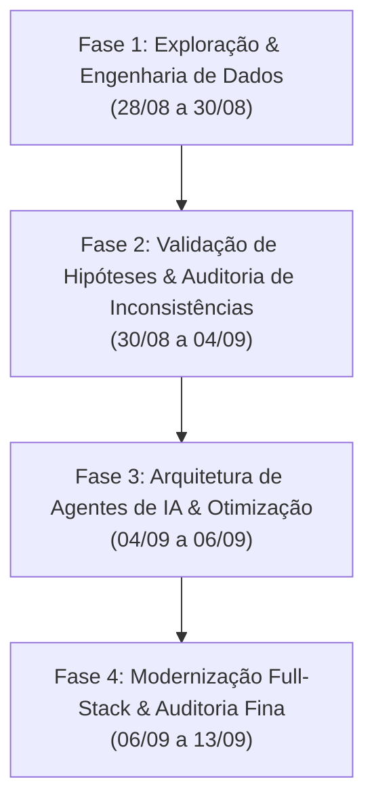

# Este arquivo resume as principais analises/observacoes/implementacoes realizadas durante o desenvolvimento. Para mais detalhes e historico de prompts/respostas, cada sessao pode ser consultada na pasta 'notes'.

# Resumo Cronológico do Projeto - Vértice Analytics (Bootcamp EloGroup 2026)

Este documento apresenta uma visão cronológica e sintetizada de todas as etapas de desenvolvimento, investigação analítica, tomadas de decisão arquitetural e implementação realizadas ao longo do projeto, com base no registro histórico disponível no diretório `notes/`.

---

## Linha do Tempo e Fases do Projeto

---

## Fase 1: Exploração do Case & Engenharia de Dados (28/08 a 30/08)
*Notas de referência: `001` a `008`*

### O que foi feito e como:
1. **Leitura e Mapeamento Inicial do Case (`001`)**:
   - Exploração das instruções do case da Vértice Retail e avaliação inicial dos 5 datasets brutos (`vendas`, `marketing`, `estoque`, `clientes`, `atendimento`).
   - Identificação dos primeiros gargalos de negócio (pressão de margem, concentração de atendimentos, ruptura de estoque e retorno de mídia).
2. **Definição da Arquitetura de Dados (`002` - `005`)**:
   - Transição de scripts soltos para o padrão profissional de **Analytics Engineering**: armazenamento colunar em arquivos **Parquet** processados e motor analítico de alta performance com **DuckDB**.
   - Separação estrita de queries SQL em arquivos `.sql` parametrizados externos, evitando hardcode inline no código Python.
   - Resolução de inconsistências de schemas e bindings de colunas (`003`) e modularização do pipeline de ingestão (`004`).
3. **Pipeline de Pré-processamento e Limpeza (`006` - `008`)**:
   - Tratamento de registros anômalos (ex: expurgo de IDs de suporte corrompidos como `ticket_id = 'TKT'`).
   - Padronização de tipos de dados, datas, valores monetários e enriquecimento de métricas calculadas.
   - Documentação de todas as premissas no `DEVELOPMENT.md`.

---

## Fase 2: Validação de Hipóteses & Auditoria Cruzada de Bases (30/08 a 04/09)
*Notas de referência: `009` a `020`*

### O que foi feito e como:
1. **Governança e Diretrizes de IA (`010`)**:
   - Criação do `AGENTS.md` definindo papéis, postura analítica rigorosa, proibição de "alucinação de cálculos financeiros" e obrigatoriedade de qualidade técnica.
2. **Investigação das Hipóteses de Negócio (`009`, `011` - `014`)**:
   - **Marketing vs. Vendas**: Diagnóstico de que os dados de marketing e de vendas representam sistemas de mensuração com metodologias e recortes temporais distintos (receita atribuída vs. receita contábil faturada). Em vez de forçar um join cego, as discrepâncias foram documentadas e auditadas tecnicamente.
   - **Suporte e Satisfação**: Investigação do suporte como termômetro de falhas logísticas e operacionais da empresa.
3. **Auditoria de Coerência e Integridade Relacional (`015` - `017`)**:
   - Criação de auditoria cruzada formal entre as 5 bases (`auditoria_coerencia_bases.md`).
   - Rastreamento de inconsistências entre CRM (clientes) e ERP (vendas), como status de clientes divergentes de transações reais.
4. **Storytelling Estratégico (`018` - `020`)**:
   - Desconstrução de soluções genéricas propostas no case em prol de planos de ação pragmáticos, priorizados e com impacto financeiro tangível.

---

## Fase 3: Desenvolvimento dos Agentes de IA & Infraestrutura (04/09 a 06/09)
*Notas de referência: `021` a `034`*

### O que foi feito e como:
1. **Arquitetura de Agentes Inteligentes (`021`, `028`, `030`)**:
   - Estudo e implementação de agentes autônomos baseados no padrão **Plan-and-Execute com nó de reflexão/crítica (Critic/Reviewer)** via **LangGraph** e agentes conversacionais reativos (**ReAct**).
   - Criação de *Tools* parametrizadas no DuckDB com schemas Pydantic tipados para consulta de estoque, histórico de vendas e tendências.
2. **Refatoração, Limpeza e Otimização de Infraestrutura (`022` - `025`)**:
   - Remoção de métodos e variáveis de ambiente legadas (`load_latest_audit_snapshot`).
   - Otimização do `Dockerfile` e `docker-compose` para builds multi-stage, otimização de cache e redução do tamanho das imagens.
3. **UX de Chat, Persistência e Diagramação (`026` - `029`, `031` - `034`)**:
   - Implementação de persistência e gerenciamento de sessões do Copiloto de Estoque (criar, listar, alternar e remover chats).
   - Suporte à renderização de diagramas Mermaid e timelines estratégicas nas respostas da IA.

---

## Fase 4: Modernização Full-Stack & Auditoria Fina de Métricas (06/09 a 13/09)
*Notas de referência: `035` a `046`*

### O que foi feito e como:
1. **Migração do Frontend para React + TypeScript (`035`, `036`)**:
   - Substituição da interface inicial em Streamlit por uma arquitetura Full-Stack moderna:
     - **Backend**: API REST em **FastAPI** (`src/api/`) com schemas Pydantic v2.
     - **Frontend**: **React + TypeScript + Vite + Tailwind CSS + Recharts** (`frontend/`), garantindo carregamento rápido, responsividade, estados de carregamento (skeletons) e proteção contra valores `NaN`/`null`.
   - Correção de divergências de nomenclatura de aliases entre queries SQL e schemas da API (`036`).
2. **Auditoria de Fatos Notáveis e Anomalias Reais (`037`, `038`, `041`)**:
   - **39 clientes marcados como "Churn" com vendas recentes**: Inclusão na seção de auditoria como evidência de defasagem do CRM.
   - **Hiperconcentração de suporte**: Constatação estatística de que 93% dos chamados pertencem a apenas 27 clientes (com 2 clientes gerando mais de 60% dos tickets por loops automáticos de integração).
   - **Tempo de Atendimento**: Análise de média (~135 min) vs. mediana (~10 min) para evidenciar assimetrias profundas por canal de suporte.
3. **Validação Estrutural da Rentabilidade e Auditoria Passo a Passo (`039`, `040`, `042`)**:
   - Auditoria minuciosa de cada tela, query e gráfico da aplicação.
   - Validação da tese central de negócio: a margem bruta de produto se manteve saudável, mas o resultado operacional foi erodido por custos de devolução, frete, estoques obsoletos e suporte descontrolado.
   - Consolidação do framework metodológico de investigação: *Exploratory Data Analysis -> Data Profiling -> Data Quality Audit -> Business Hypothesis Testing -> AI Agents Modeling -> Executive Storytelling*.
4. **Polimento Final e Validação com Skills (`043` - `046`)**:
   - Simplificação da linguagem executiva dos dashboards (removendo disclaimers desnecessários e focando em clareza para tomadores de decisão).
   - Validação do Copiloto de Estoque em cenários de tendência histórica e auditorias finais de consistência.

---

## Síntese dos Principais Resultados e Entregáveis

| Dimensão | O que foi entregue |
| :--- | :--- |
| **Camada de Dados** | Pipeline Parquet + DuckDB com queries SQL externalizadas e livres de duplicações. |
| **Auditoria & Qualidade** | Diagnóstico completo de sanidade de dados, anomalias de suporte, gaps de CRM e métricas conciliadas. |
| **Backend API** | FastAPI modularizado em routers e schemas Pydantic v2 com endpoints analíticos e de governança. |
| **Frontend Web** | Aplicação React + Vite + TypeScript com visual executivo corporativo, navegação por abas e visualizações ricas (Recharts). |
| **Agentes de IA** | Copiloto e Auditor de Estoque com LangGraph (Plan-and-Execute + Critic) e ReAct integrados diretamente ao banco de dados. |
