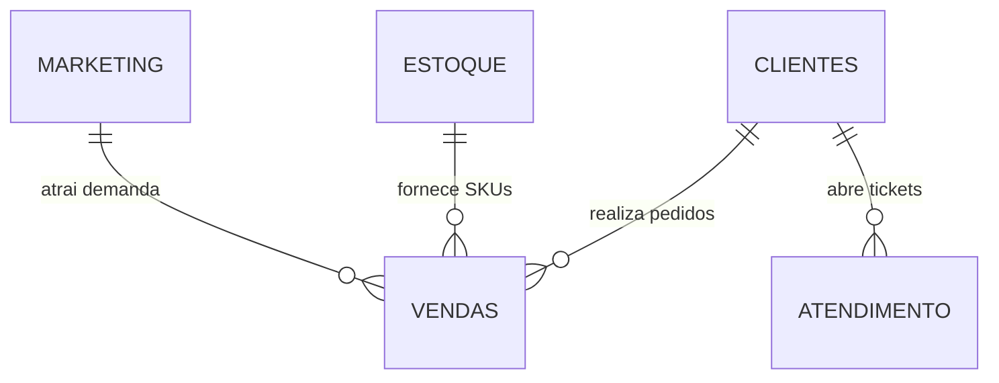
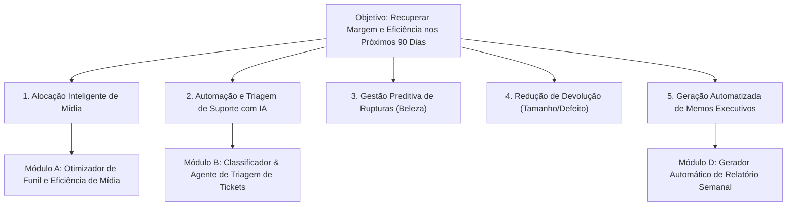

# Antigravity: Analise o case no html, os csvs de forma resumida ( a estrut... (2026-08-28)

---
type: "event"
workspace: "workspace1"
project: "elogroup-bootcamp"
status: "resolved"
tags: []
occurred_at: "2026-08-28T12:00:00.000Z"
---

# Antigravity: Analise o case no html, os csvs de forma resumida ( a estrut... (2026-08-28)

Source: Antigravity

---

### 👤 User
Analise o case no html e os csvs de forma resumida e gere um relatorio traçando pontos e observações relevantes para o contexto do case

### ✨ Assistant
Este relatório executivo apresenta a análise completa do **Case do BootCamp EloGroup 2026 (Projeto Vértice Retail)** e a exploração estrutural e quantitativa detalhada de todos os conjuntos de dados (*Data Room*).

---

# 1. Visão Geral do Case: O Desafio da Vértice Retail

### Contexto de Negócio
A **Vértice Retail** é uma marca digital nativa de moda, beleza e lifestyle voltada ao público jovem adulto. Impulsionada pelo e-commerce, redes sociais, tráfego pago e influenciadores, a companhia alcançou rápido crescimento em volume de vendas, mas enfrenta agora **compressão de rentabilidade e perda de eficiência operacional**.

A liderança executiva (CEO, CFO, CMO e COO) identifica quatro dores fundamentais:
1. **Margem Pressionada:** O crescimento em receita bruta não está se convertendo em ganho de margem de contribuição saudável.
2. **Dados Fragmentados & Decisões por "Feeling":** Falta integração entre os dados de marketing, vendas, atendimento e estoque.
3. **Ineficiência Operacional & Retrabalho:** Processos de atendimento manuais, lentos e caros, somados a desequilíbrios na cadeia de suprimentos e altos índices de devolução.
4. **Governança de IA e Automação:** Necessidade de implantar soluções de inteligência de dados e IA generativa/preditiva com **impacto mensurável em um horizonte de 30, 60 e 90 dias**.

---

# 2. Estrutura e Dicionário Geral dos Dados (*Data Room*)

O Data Room é composto por **5 bases de dados relacionais/simuladas**, cobrindo a jornada de ponta a ponta:



### Resumo Estrutural das Bases

| Base de Dados | Registros | Atributos | Granularidade / Chave Primária | Integridade & Qualidade |
| :--- | :---: | :---: | :--- | :--- |
| **`Vendas.csv`** | **27.759** | 20 | Item de pedido (`order_id`) | 1 linha nula de cabeçalho corrigida. Contém métricas financeiras completas (receita bruta, desconto, frete, custo do produto, margem). |
| **`Marketing.csv`** | **3.500** | 15 | Campanha de marketing (`campanha_id`) | Dados de funil de mídia (investimento, impressões, cliques, conversões, CAC e ROAS). Sem nulos. |
| **`Clientes.csv`** | **15.000** | 14 | Cliente cadastrado (`customer_id`) | Dados demográficos, RFM, LTV histórico, dispositivo e opt-in. Sem nulos. |
| **`Atendimento.csv`** | **35.841** | 12 | Ticket de suporte (`ticket_id`) | Canal de entrada, categoria, texto do cliente, custo operacional, SLA e nota CSAT. 1 linha residual corrigida. |
| **`Estoque.csv`** | **5.000** | 16 | Produto individual (`sku_id`) | Ponto de pedido, estoque físico/disponível, lead time de reposição, fornecedor e status de ruptura. Sem nulos. |

---

# 3. Diagnóstico Quantitativo e Principais Descobertas

### 3.1. Vendas & Margem de Contribuição
* **Volume e Receita:** 27.758 pedidos válidos analisados entre jan/2023 e jan/2024, totalizando **R$ 20.526.133,84 em receita bruta** e **R$ 18.889.334,01 em receita líquida** (ticket médio de ~R$ 739,00).
* **Estrutura de Custos e Margem:**
  * **Descontos Concedidos:** R$ 1.636.799,83 (**7,97%** da receita bruta).
  * **Custo do Produto (CMV):** R$ 8.278.603,59 (**43,83%** da receita líquida).
  * **Custo de Frete:** R$ 340.293,77 (**1,80%** da receita líquida).
  * **Margem de Contribuição Agregada:** **R$ 10.270.436,65** (**54,37%** de margem líquida).
* **Ponto Crítico - Sazonalidade & Desconto:** No mês de pico de vendas (Black Friday / Novembro), a receita atinge R$ 3,0M (+135% vs média mensal), porém o desconto salta para **9,55%** e a margem de contribuição cai para **53,22%** (pior rentabilidade percentual do ano).
* **Ponto Crítico - Devoluções Destrutivas:** 
  * A taxa média de devolução é de **14,86%** (4.127 pedidos devolvidos).
  * Impacto direto: **R$ 3.063.300,53 em receita bruta perdida** + **R$ 51.006,15 em frete reverso desperdiçado**.
  * Principais causas de devolução: **Produto com defeito (25,18%)**, **Tamanho errado (24,84%)** e **Atraso na entrega (19,58%)**. Juntas, essas três causas representam **69,6% das devoluções**.

---

### 3.2. Marketing & Eficiência de Canais
* **Visão Global:** R$ 210,4M investidos em 3.500 campanhas, gerando R$ 878,6M em receita atribuída (**ROAS Global de 4,18x**, CAC médio de R$ 1,83, CTR de 3,43% e taxa de conversão no site de 6,63%).
* **Disparidade Extrema de Retorno por Canal:**

| Canal de Marketing | Investimento Total | Receita Gerada | ROAS | CAC Médio | Eficiência / Diagnóstico |
| :--- | :---: | :---: | :---: | :---: | :--- |
| **Influenciador** | R$ 28,06M | **R$ 217,58M** | **7,75x** | R$ 1,76 | **Canal estrela:** Altíssimo retorno, menor custo e forte tração para Moda e Acessórios. |
| **TikTok Ads** | R$ 29,77M | R$ 139,06M | **4,67x** | R$ 1,75 | **Alta performance:** Excelente conversão no público jovem. |
| **Instagram Ads** | R$ 30,17M | R$ 135,94M | **4,51x** | R$ 1,96 | **Sólido:** Bom engajamento e conversão em Moda/Beleza. |
| **Google Ads** | R$ 30,22M | R$ 106,56M | **3,53x** | R$ 1,88 | **Moderado:** Alto volume de busca com margem decrescente. |
| **Email Marketing** | R$ 29,70M | R$ 91,05M | **3,07x** | R$ 1,79 | **Subutilizado:** Foco excessivo em disparo genérico; baixa personalização. |
| **Marketplace** | R$ 32,68M | R$ 98,80M | **3,02x** | R$ 1,83 | **Iniciativa ineficiente:** Maior volume de investimento com o menor ROAS do portfólio. |
| **Orgânico** | R$ 29,81M | R$ 89,65M | **3,01x** | R$ 1,82 | **Baixo impacto incremental** relativo ao investimento alocado. |

---

### 3.3. Cadeia de Suprimentos & Estoque
* **Portfólio:** 5.000 SKUs com valor total em estoque disponível de **R$ 296,5M (a custo)**.
* **Gargalo Crítico Concentrado na Categoria Beleza:**
  * Das 99 rupturas de estoque identificadas em todo o catálogo, **96 estão na categoria Beleza (6,35% de todos os SKUs de Beleza em ruptura total)**.
  * O **lead time médio de reposição dos produtos em ruptura é de 50,9 dias** (quase o dobro da média geral de 27,0 dias).
  * Cinco fornecedores específicos (`FORN-081`, `FORN-005`, `FORN-067`, `FORN-015`, `FORN-050`) concentram mais de 30% de todos os produtos com falha de fornecimento.
* **Impacto Cruzado:** Falta de produto em Beleza aliada a atrasos na entrega geram cancelamentos, reclamações de rastreio e perda de vendas recorrentes.

---

### 3.4. Atendimento ao Cliente (*Customer Service*)
* **Volume e Custo:** 35.840 tickets de atendimento, gerando um custo operacional de **R$ 532.260,00** e uma nota **CSAT média de 3,24 / 5,00**.
* **Concentração de Temas:**
  1. **"Onde está meu pedido?" (WISMO):** 10.765 chamados (**30,04%** do total), consumindo **R$ 159.660,00** e gerando nota CSAT baixa (2,99).
  2. **"Defeito":** 6.509 chamados (**18,16%** do total), com o pior CSAT da operação (**2,82**).
  3. **"Troca de Tamanho":** 5.360 chamados (**14,96%** do total).
* **Ineficiência de Canais e SLA:**
  * O canal **ChatBot** custa apenas **R$ 2,00 por ticket** e responde em **1,5 minuto** (CSAT 3,26), mas atende apenas **20% dos tickets**.
  * Canais manuais como **WhatsApp** (35,3% dos tickets) e **E-mail** (24,9% dos tickets) custam **R$ 15,00 por ticket**, acumulando mais de **R$ 323.700,00** em custos manuais.
  * O canal **Reclame Aqui** (8,2% dos tickets) custa **R$ 45,00 por ticket** e possui tempo médio de resposta de **778 minutos (~13 horas)**, gerando R$ 131.805,00 em custo operacional e dano reputacional.

---

### 3.5. Base de Clientes e Segmentação RFM
* **Base Total:** 15.000 clientes cadastrados com LTV acumulado de R$ 139,1M.
* **Concentração de Valor:**
  * Os segmentos **Campeão (8,45%)** e **Fiel (17,41%)** somam apenas **25,86% da base**, mas representam **56,04% de todo o LTV gerado** (R$ 77,9M).
  * Por outro lado, **46,62% dos clientes** estão nos segmentos **Em Risco (21,8%)**, **Hibernando (12,9%)** e **Churn (12,0%)**, demonstrando baixa capacidade atual de retenção pós-primeira compra.

---

# 4. Árvore de Oportunidades e Módulos de Solução com IA



### Oportunidades Priorizadas (Matriz Impacto vs. Esforço)

1. **Módulo B: Classificador Inteligente e Agente de Triagem de Atendimento (Quick Win / Alto Impacto)**
   * **Dor atacada:** 30% dos tickets são solicitações repetitivas de rastreio (*WISMO*) tratadas manualmente a R$ 15-45/ticket.
   * **Solução com IA:** Agente de triagem LLM que lê o texto do cliente, identifica entidade e sentimento, consulta a API de logística em tempo real e responde proativamente no WhatsApp/Chatbot.
   * **Impacto:** Redução de ~65% do volume de atendimento humano em WISMO, economizando mais de R$ 180k/ano e reduzindo o tempo de resposta de 13h para segundos no Reclame Aqui e E-mail.

2. **Módulo A: Rebalanceamento de Mídia com Base em Margem e ROAS Real**
   * **Dor atacada:** Marketplace e Google Ads consomem mais de R$ 62M com ROAS de ~3,0x, enquanto Influenciadores entregam 7,75x.
   * **Solução:** Rebalanceamento de 25% a 35% da verba de Marketplace/Google Ads para Influenciadores e TikTok Ads.
   * **Impacto:** Aumento direto estimado de **+12% a +18% na receita gerada por marketing com o mesmo orçamento**, além de atração de clientes com maior propensão a recompra.

3. **Módulo C/D: Gerador Automático de Relatórios Gerenciais (Agentic Memo)**
   * **Dor atacada:** Relatórios manuais, fragmentados e lentos para a diretoria.
   * **Solução:** Pipeline em Python + LLM que consolida vendas semanais, alerta sobre picos de desconto, monitora rupturas de estoque e entrega um relatório executivo pronto para tomada de decisão.
   * **Impacto:** Eliminação do tempo operacional de compilação de dados da equipe de analytics e alinhamento em tempo real da diretoria.

---

# 5. Roadmap Estratégico de Implementação (30-60-90 Dias)

| Horizonte | Foco Estratégico | Ações e Entregas Chave | KPIs de Sucesso |
| :--- | :--- | :--- | :--- |
| **0 a 30 Dias**<br>*(Quick Wins)* | **Eficiência Imediata & Automação de WISMO** | • Realoque de budget de mídia paga (Marketplace → Influenciadores / TikTok).<br>• Lançamento do Agente IA para resolução automática de tickets de rastreio ("Onde está meu pedido?").<br>• Renegociação com os 5 fornecedores críticos de Beleza para redução de lead time. | • +15% no ROAS médio semanal.<br>• -50% nos custos de tickets WISMO.<br>• Redução de tempo de resposta para < 5 min. |
| **31 a 60 Dias**<br>*(Estruturação)* | **Retenção de Clientes & Qualidade de Produto** | • Triagem automática de tickets por risco de *churn* para clientes *Campeões* e *Fiéis* (SLA VIP).<br>• Implementação de provador virtual / recomendador inteligente de tamanhos na categoria Moda.<br>• Protocolo de auditoria de qualidade em produtos de fornecedores com alta taxa de defeito. | • Taxa de devolução de Moda caindo de 14,3% para < 11%.<br>• Recuperação de 15% dos clientes no segmento *Em Risco*. |
| **61 a 90 Dias**<br>*(Escala & Governança)* | **Decisão Autônoma & Integração Total** | • Implantação do Gerador Automático de Memos Executivos semanais para a diretoria.<br>• Algoritmo preditivo de estoque que dispara alertas de ponto de pedido automático com base na demanda de campanhas.<br>• Governança de IA (monitoramento de alucinação, compliance de dados e latência). | • 100% de automação do relatório executivo.<br>• Ruptura em Beleza reduzida para < 1,5%.<br>• Ganho líquido de margem de contribuição consolidado. |

---

# 6. Alinhamento com a Apresentação Final (Roteiro dos 11 Slides)

Para a estruturação da entrega final exigida no case, este diagnóstico mapeia os 11 slides da apresentação executiva:

```
Slide 01: Contexto e Pergunta Central      -> Vértice Retail: Como recuperar rentabilidade e eficiência em 90 dias com IA.
Slide 02: Diagnóstico do Negócio           -> Crescimento com margem comprimida (descontos, devoluções de 14,8%, custo de suporte).
Slide 03: Árvore de Hipóteses              -> Desdobramento: Mídia ineficiente vs. Suporte manual vs. Ruptura de estoque.
Slide 04: Principais Insights              -> Influenciadores ROAS 7,75x; Beleza com 96 rupturas; 30% do suporte é WISMO.
Slide 05: Oportunidades Priorizadas        -> Matriz Impacto vs Esforço (Automação de Suporte + Rebalanceamento de Mídia).
Slide 06: Solução com IA                   -> Arquitetura do Agente de Atendimento Inteligente + Gerador de Memo.
Slide 07: Demonstração                     -> Protótipo funcional de IA (classificador de tickets / gerador de insights).
Slide 08: Business Case                    -> Economia anual de ~R$ 250k em suporte + R$ 3M+ protegidos em vendas e devoluções.
Slide 09: Roadmap 30-60-90                 -> Plano de captura rápida em 3 sprints progressivos.
Slide 10: Riscos e Governança              -> Mitigação de alucinação de IA, proteção de dados e esteira de revisão humana.
Slide 11: Recomendação Final               -> Aprovação da diretoria para início imediato do Sprint 0-30 dias.
```

---

> [!TIP]
> **Rastreabilidade dos Artefatos de Processo:**
> Como exigido no regulamento do case, mantenha os códigos de análise exploratória, prompts dos agentes e logs de sanity check versionados em arquivos `.md` ou `.html` para demonstrar a robustez técnica e metodológica da squad.