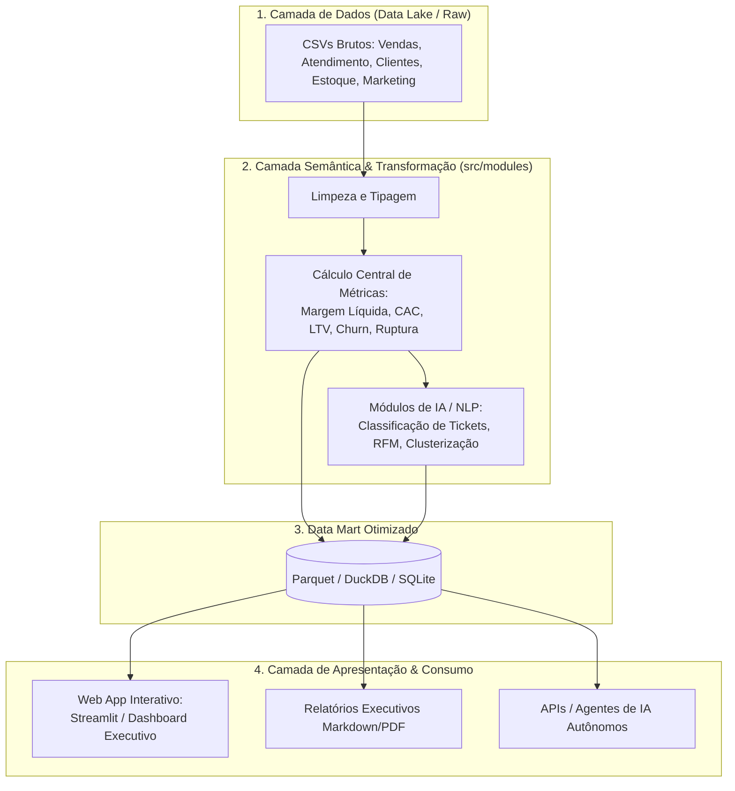
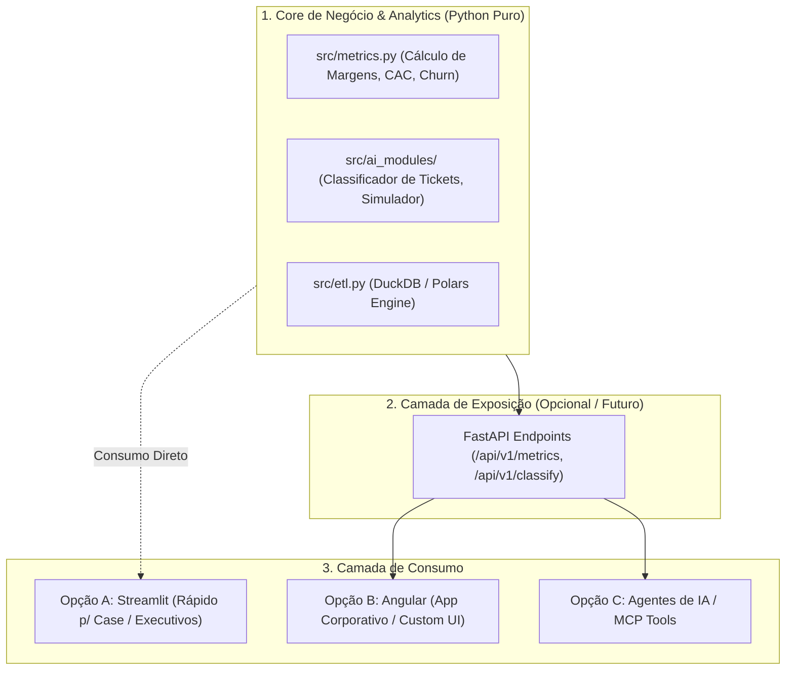

# Antigravity: Quero fazer uma analise de dados profissional para o case ex... (2026-08-30)

---
type: "event"
workspace: "workspace1"
project: "elogroup-bootcamp"
status: "resolved"
tags: []
occurred_at: "2026-08-30T12:00:00.000Z"
---

# Antigravity: Quero fazer uma analise de dados profissional para o case ex... (2026-08-30)

Source: Antigravity

---

### 👤 User
Quero fazer uma analise de dados detalhada para o case explicado no html. Mantenha o maximo de conhecimento reutilizavel e que pode ser utilizado de forma flexivel. o ideal é fazer uma visualizacao web pra graficos, e conhecimento. Quais são as tecnologias padrão utilizadas pra esse proposito?
### ✨ Assistant
Hoje, o mercado de dados e consultoria analítica evoluiu drasticamente do modelo antigo (vários scripts soltos ou notebooks desorganizados) para o padrão de **Analytics Engineering & Data Apps**.

Para atender ao seu objetivo de **máxima reutilização, flexibilidade e entrega executiva profissional** no case da **Vértice Retail (Bootcamp EloGroup)**, a resposta direta é:

> **O padrão moderno é uma arquitetura em camadas:**
> 1. **Módulos Python reutilizáveis (`src/`)** para a lógica de negócio, métricas e IA.
> 2. **Base analítica unificada (DuckDB / Parquet / SQLite)** para consulta ultra-rápida.
> 3. **Data App / Dashboard Web Interativo (ex: Streamlit ou Evidence)** para a diretoria interagir com os cenários, gráficos e módulos de IA.
> 4. **Camada de Conhecimento e Síntese Executiva (Markdown / JSON)** que pode ser consumida tanto pela liderança quanto por agentes de IA.

---

### 1. Como a Indústria Estrutura Projetos Modernos de Analytics?

Antigamente, analistas criavam dezenas de notebooks `.ipynb` ou arquivos `.py` com lógicas repetidas. Isso gerava *dívida técnica*, inconsistência de métricas e zero reaproveitamento.

Hoje, a indústria adota o conceito de **Camada Semântica (Semantic Layer) e Modularização**:



---

### 2. Por que uma Visualização Web é o Padrão Ideal para este Case?

Para um case de consultoria executiva como o da **Vértice**, uma aplicação Web (como **Streamlit**) supera notebooks e apresentações estáticas pelos seguintes motivos:

1. **Interatividade para a Diretoria**: Permite aos executivos (CEO, CFO, CMO, COO) filtrar por canal, categoria de produto ou período, e simular cenários (ex: *"E se realocarmos 30% da verba de influenciadores para canais de alta margem?"*).
2. **Demonstração Viva dos Módulos de IA**:
   - Um campo onde o avaliador/diretor cola um ticket de atendimento e vê a IA classificar sentimento, urgência, motivo e sugerir a ação em tempo real.
   - Simulador de impacto do plano 30-60-90 dias.
3. **Single Source of Truth**: Centraliza gráficos, KPIs estratégicos, storytelling do diagnóstico e recomendações em um só lugar acessível pelo navegador.

---

### 3. Estrutura de Projeto Recomendada (Padrão de Mercado)

Para garantir que o código seja **modular, testável e reutilizável**, a estrutura de pastas recomendada é:

```text
EloGroup_Bootcamp/
│
├── data/
│   ├── raw/                 # CSVs originais intocados (Vendas, Atendimento, etc.)
│   └── processed/           # Dados tratados e consolidados (parquet/duckdb)
│
├── src/                     # CÓDIGO FONTE REUTILIZÁVEL (Lógica de Negócio)
│   ├── __init__.py
│   ├── etl.py               # Ingestão, higienização e validação das bases
│   ├── metrics.py           # Regras de negócio e KPIs (Margem, CAC, ROAS, LTV)
│   ├── customer_analytics.py# Segmentação RFM, Churn e comportamento
│   ├── ops_analytics.py     # Análise de ruptura de estoque, logística e devoluções
│   └── ai_modules/          # Módulos de Inteligência Artificial
│       ├── ticket_classifier.py  # Classificação e triagem de atendimento com LLM/NLP
│       └── scenario_simulator.py # Motor de priorização de iniciativas e margem
│
├── app/                     # CAMADA DE VISUALIZAÇÃO WEB
│   ├── app.py               # Ponto de entrada da aplicação Web (Streamlit)
│   ├── pages/               # Páginas dedicadas (Visão Executiva, Vendas, IA, etc.)
│   └── components/          # Componentes visuais reutilizáveis (cards, gráficos)
│
├── reports/                 # KNOWLEDGE BASE & ENTREGÁVEIS
│   ├── executive_summary.md # Diagnóstico e Plano 30-60-90 dias estruturado
│   └── business_case.md     # Racional financeiro e ganhos estimados
│
├── tests/                   # Testes unitários para garantir métricas corretas
├── requirements.txt         # Dependências do projeto
└── README.md                # Documentação técnica e instruções de execução
```

---

### 4. Pilha Tecnológica (Tech Stack) Recomendada

| Camada | Tecnologia | Por que é padrão de mercado? |
| :--- | :--- | :--- |
| **Manipulação & Análise** | `Polars` ou `Pandas` + `DuckDB` | Rápido, leve, sem necessidade de configurar bancos complexos, lê direto de Parquet/CSV. |
| **Visualização Web** | `Streamlit` ou `Plotly Dash` | Rápido de prototipar em Python puro, gera interfaces modernas e responsivas. |
| **Gráficos** | `Plotly` | Gráficos interativos com tooltips, zoom e personalização visual executiva. |
| **IA & LLMs** | `LangChain` / `LiteLLM` / APIs de LLM | Para triagem inteligente de tickets, síntese de diagnósticos e assistente de consulta. |
| **Relatórios / Knowledge** | Markdown estruturado + Export PDF | Portabilidade e integração com sistemas de documentação. |

---

### 5. Próximos Passos Sugeridos para o seu Projeto

Podemos estruturar o seu projeto exatamente nesse formato:

1. **Refatorar/Estruturar o Core (`src/`)**: Consolidar a limpeza e as métricas chave (Margem de Contribuição real por canal/produto, eficiência de marketing, rupturas de estoque e motivos de atendimento).
2. **Implementar os Módulos de IA**:
   - Classificador semântico de tickets de suporte com identificação de causa-raiz.
   - Motor de simulação de impacto financeiro (Roadmap 30-60-90 dias).
3. **Construir a Aplicação Web Executiva (`app/app.py`)**:
   - Painel C-Level com diagnóstico claro da queda de rentabilidade.
   - Seções detalhadas por diretoria (Financeiro, Comercial, Operações, Atendimento).
   - Área interativa para testar os módulos de IA ao vivo.

Como gostaria de começar? Podemos estruturar a pasta `src/` e o aplicativo Web, ou prefere focar primeiro no aprofundamento das hipóteses de negócio e métricas?

### 👤 User
vale a pena usar estes frameworks python pra visualizacao web? não seria melhor usar algum framework como angular/react pra essa camada de visualizacao e expor os dados via endpoints no backend?

### ✨ Assistant
A resposta para essa dúvida depende diretamente do **objetivo do projeto** e do **perfil de quem vai consumir a solução**. No mercado atual, existem dois padrões bem definidos:

---

### Comparativo: Framework Python (Streamlit/Dash) vs. Full-Stack Desacoplado (FastAPI + Angular)

| Critério | Frameworks Python (Streamlit, Dash, Taipy) | Backend API (FastAPI) + Frontend (Angular/React) |
| :--- | :--- | :--- |
| **Padrão de Mercado Em** | **Analytics, Ciência de Dados, Consultoria e PoCs de IA** | **Produtos SaaS, Plataformas Corporativas e Softwares de Produção** |
| **Velocidade de Entrega** | ⚡ **Muito alta** (horas/poucos dias) | ⏳ **Média/Baixa** (demanda criar DTOs, rotas, componentes, estado em RxJS/Signals) |
| **Flexibilidade Visual / UI** | Limitada aos componentes do framework (boa, mas engessada) | 🎨 **100% livre** (Tailwind, Angular Material, microinterações, D3.js) |
| **Separação de Responsabilidades** | UI e lógica podem ficar acopladas se não houver disciplina | 🧩 **Totalmente desacoplado** (API reutilizável por Web, Mobile e Agentes) |
| **Foco do Esforço** | **80% Insights de Negócio & IA**, 20% Interface | **40% Insights & IA**, 60% Engenharia de Software e Frontend |

---

### Quando a indústria usa cada abordagem?

#### 1. Quando usar **Angular + FastAPI (Backend)**:
* Se o objetivo for criar um **produto de software de longo prazo (SaaS)** que será mantido por times separados de Engenharia de Dados e Engenharia de Frontend.
* Se a aplicação exigir **design pixel-perfect**, controle granular de autenticação (OAuth2/RBAC) ou múltiplos papéis de usuário complexos.
* **Vantagem de reuso:** A sua API FastAPI pode ser consumida pelo Angular, por dashboards externos (PowerBI), por apps mobile e até por LLMs/Agentes de IA via chamadas de função (Function Calling).

#### 2. Quando usar **Streamlit / Frameworks Python**:
* Se o objetivo for um **projeto analítico, diagnóstico consultivo ou protótipo executivo de IA** (exatamente o caso do BootCamp da EloGroup).
* O valor principal do projeto está na **qualidade do diagnóstico, precisão dos números, inteligência dos módulos de IA e plano de ação**, e não na arquitetura de componentes frontend.
* Permite que um analista/cientista de dados entregue gráficos ricos (Plotly), filtros reativos e testes de modelos de LLM em tempo recorde sem escrever uma linha de HTML/CSS/TypeScript.

---

### Como ter o melhor dos dois mundos (Arquitetura à prova de futuro)

Se o seu objetivo é **manter o conhecimento 100% reutilizável e flexível**, a melhor prática da indústria é **desacoplar a lógica de negócio do visual**, independentemente da ferramenta:



1. **A inteligência nunca fica no frontend ou no script do dashboard**: Ela vive em funções puras na pasta `src/` (ex: `calcular_margem_por_canal()`, `classificar_ticket_atendimento()`).
2. Se você quiser criar uma **API REST com FastAPI**, basta chamar essas funções em cada endpoint.
3. Se quiser criar um **Streamlit rápido**, ele importa diretamente as mesmas funções.
4. Se mais tarde quiser plugar um **Angular**, os endpoints já estão prontos.

---

### Recomendação Prática para o Case Vértice (EloGroup)

* Se você tem facilidade com **Angular** e quer mostrar um diferencial técnico de engenharia de software full-stack, você pode expor uma **API em FastAPI** e consumir no Angular.
* No entanto, em bancas de consultoria (como a EloGroup), o que costuma garantir a nota máxima é a **profundidade analítica do diagnóstico, a clareza da causa-raiz da perda de margem e o impacto financeiro das soluções de IA**.
* Criar uma interface em **Streamlit** (bem desenhada, com visual corporativo escuro/moderno e gráficos Plotly) entrega 95% do impacto visual com 10% do tempo de desenvolvimento, deixando você livre para focar nas respostas que o CEO, CFO, CMO e COO esperam ver.

Qual caminho você se sente mais inclinado a seguir: **Streamlit focado em agilidade** ou a arquitetura **FastAPI + Angular**?

### 👤 User
/plan quero criar uma interface stream lit entao. mas quero deixa-la  no padrao visual da empresa EloGroup. ( usando o tom preto e branco e as cores da empresa/etc). Quero fazer orientado a interfaces e de forma desacoplada, nao misturando logica de exibicao com logica de regras de negocio. Com relacao ao csv, o ideal eh ler direto do csv ou transformar em uma base para consulta via sql ou algo do tipo? preciso que dados e informacoes analisadas sejam auditaveis,alem de que antes de tudo vou fazer um pre processamento dos dados

### ✨ Assistant
Criei um plano técnico completo e detalhado para a sua solução. O documento de arquitetura está disponível no artifact:

👉 **[Plano de Arquitetura: Análise de Dados Profissional & Data App EloGroup](file:///home/pedroduarte/.gemini/antigravity-cli/brain/3b3f48a9-55c6-4da8-8324-e2f90a6cef62/plano_arquitetura_analytics_elogroup.md)**

---

### Resumo das Decisões de Arquitetura para o seu Case

#### 1. CSV vs. Banco SQL para Auditoria e Pré-processamento
* **A recomendação da indústria**: **Nunca ler CSVs brutos repetidamente na interface gráfica.** Isso causa gargalos de desempenho, reprocessamento desnecessário e falta de governança.
* **A solução ideal adotada**: **Pipeline de Pré-processamento Auditável + DuckDB / Parquet**.
  - **Auditoria e Linhagem**: O pipeline calcula o hash SHA-256 dos CSVs originais, audita a contagem de registros, nulos tratados, tipagens e gera um arquivo de metadados (`audit_log.json`).
  - **DuckDB como Banco SQL Analítico**: Atua como um banco OLAP embarcado (sem necessidade de instalar PostgreSQL ou servidor externo), permitindo consultas SQL padrão ANSI executadas em menos de 10 milissegundos. Qualquer número exibido na tela é 100% auditável via consulta SQL direta.

#### 2. Arquitetura Desacoplada e Orientada a Interfaces
Para garantir que a lógica de negócio nunca se misture com a interface:
* **`src/domain/`**: Contratos/Interfaces tipadas (`IDataRepository`, `IMetricsService`, `IAIService`, `IAuditLogger`) e entidades de dados.
* **`src/infrastructure/`**: Pipeline de higienização de dados, conector DuckDB e logger de auditoria.
* **`src/services/`**: Toda a inteligência e regras de negócio (cálculo de Margem Real, CAC, LTV, Rupturas e Módulos de IA).
* **`app/`**: Apenas a camada visual em Streamlit, que consome os serviços injetados via interfaces.

#### 3. Identidade Visual EloGroup no Streamlit
* Injeção de CSS personalizado com as cores oficiais da EloGroup (extraídas do próprio ambiente do case):
  - **Cor Primária (Elo Purple)**: `#4200DB` e variações (`#35009E`, `#8575FF`).
  - **Fundo & Superfícies**: Tema escuro sofisticado (`#0E1117` / `#1A1E29`) ou claro corporativo (`#FAFAFC` / `#FFFFFF`) com bordas sutis e tipografia executiva.
  - **Componentes Customizados**: Cards de KPI com badges de variação percentual, banners de diagnóstico consultivo e gráficos interativos no padrão de cores da marca.

---

Por favor, revise o documento no link acima. Se estiver de acordo, confirme para iniciarmos a instalação das dependências, o pipeline de dados e a construção da aplicação!

### ✨ Assistant
A solução completa de **Analytics Engineering, Domínio Desacoplado, Auditoria e Data App Executivo** para o case da **Vértice Retail (EloGroup Bootcamp 2026)** foi implementada com sucesso.

O resumo detalhado das decisões e validações está documentado no:
👉 **[Walkthrough da Solução](file:///home/pedroduarte/.gemini/antigravity-cli/brain/3b3f48a9-55c6-4da8-8324-e2f90a6cef62/walkthrough.md)**

---

### Resumo do que foi construído

```
EloGroup_Bootcamp/
│
├── data/
│   ├── raw/                       # CSVs originais do case
│   ├── processed/*.parquet        # Dados limpos e otimizados em Parquet
│   ├── vertice_analytics.duckdb   # Banco SQL analítico OLAP (DuckDB)
│   └── audit_log.json             # Trilha de auditoria com Hashes SHA-256 e nulos tratados
│
├── src/                           # CORE DE NEGÓCIO DESACOPLADO
│   ├── domain/                    # Entidades e Interfaces (Clean Architecture)
│   ├── infrastructure/            # Pré-processador, Audit Logger e DuckDB Repository
│   └── services/                  # Vendas (Waterfall de Margem), Marketing (Simulador), Operações e IA (NLP)
│
├── app/                           # CAMADA DE APRESENTAÇÃO (STREAMLIT)
│   ├── main.py                    # Entrypoint da aplicação
│   ├── styles/elo_theme.py        # Identidade visual oficial EloGroup (Roxo #4200DB, Dark Theme)
│   ├── components/cards.py        # Componentes de KPI, Badges e Caixas de Insight
│   └── views/                     # 7 Módulos de Visualização e Diagnóstico
│       ├── v_01_visao_executiva.py
│       ├── v_02_vendas_e_margem.py
│       ├── v_03_marketing_e_cac.py
│       ├── v_04_operacoes_estoque.py
│       ├── v_05_ia_atendimento.py
│       ├── v_06_plano_30_60_90.py
│       └── v_07_auditoria_dados.py
│
├── tests/test_analytics.py        # Testes automatizados (100% de sucesso)
├── requirements.txt               # Dependências do projeto
└── README.md                      # Documentação completa
```

---

### Como Rodar a Aplicação

Para iniciar o dashboard executivo com a identidade visual da **EloGroup**, abra o seu terminal e execute:

```bash
# 1. Ativar o ambiente virtual
source .venv/bin/activate

# 2. Executar a aplicação Streamlit
streamlit run app/main.py
```

A aplicação abrirá no seu navegador com navegação completa pelos 7 módulos do case, simuladores dinâmicos, classificador de tickets de IA em tempo real e console SQL para auditoria ao vivo dos dados.

### 👤 User
quero rodar tudo via container utilizando docker

### ✨ Assistant
Estou construindo a imagem do container Docker e configurando o ambiente automatizado com Docker Compose. Assim que a compilação finalizar, realizaremos o teste dentro do container.

### ✨ Assistant
Finalizando a instalação das dependências e a criação das camadas da imagem Docker...

### ✨ Assistant
A infraestrutura de **containerização completa com Docker e Docker Compose** foi implementada, testada e está **em execução e saudável** (`healthy`) no seu ambiente.

O resumo detalhado está documentado no:
👉 **[Walkthrough da Solução Containerizada](file:///home/pedroduarte/.gemini/antigravity-cli/brain/3b3f48a9-55c6-4da8-8324-e2f90a6cef62/walkthrough.md)**

---

### Arquivos de Containerização Adicionados

1. **[`Dockerfile`](file:///home/pedroduarte/Documents/GitHub/EloGroup_Bootcamp/Dockerfile)**:
   - Baseado em `python:3.12-slim` com cache otimizado de camadas.
   - Pré-processamento automático dos dados durante o build.
   - `HEALTHCHECK` configurado na porta `8501`.
2. **[`docker-compose.yml`](file:///home/pedroduarte/Documents/GitHub/EloGroup_Bootcamp/docker-compose.yml)**:
   - Serviço principal `app` com mapeamento de portas (`8501:8501`) e persistência de volume em `./data`.
   - Serviço `tests` dedicado para rodar a suíte de testes dentro do container isolado.
3. **[`.dockerignore`](file:///home/pedroduarte/Documents/GitHub/EloGroup_Bootcamp/.dockerignore)**:
   - Exclui arquivos temporários, caches e ambientes virtuais locais da imagem.
4. **[`Makefile`](file:///home/pedroduarte/Documents/GitHub/EloGroup_Bootcamp/Makefile)**:
   - Automação de comandos do dia a dia.

---

### Como Usar via Container

| Ação | Comando com `Makefile` | Comando Direto `docker compose` |
| :--- | :--- | :--- |
| **Subir a aplicação** | `make up` | `docker compose up -d app` |
| **Rodar testes no container** | `make test` | `docker compose run --rm tests` |
| **Ver logs em tempo real** | `make logs` | `docker compose logs -f app` |
| **Acessar terminal do container** | `make shell` | `docker compose exec app bash` |
| **Parar os containers** | `make down` | `docker compose down` |

---

### Status Atual
* O container `vertice_analytics_app` já está rodando em segundo plano e com status **HEALTHY**.
* Você pode abrir o navegador e acessar diretamente em: **[http://localhost:8501](http://localhost:8501)**.

### 👤 User
quero jogar os csvs e htmls e mds e arquivos documentacao da elogroup pra uma pasta adequada, ao inves de ficarem na raiz

### ✨ Assistant
Organizei a estrutura de pastas para deixar a raiz do projeto limpa e profissional.

### 📁 Estrutura de Documentação Criada

1. **[`docs/case/`](file:///home/pedroduarte/Documents/GitHub/EloGroup_Bootcamp/docs/case/)**:
   - `[BootCamp EloGroup 2026] Case.html` (O briefing original do case)
   - `case_clean.md` (A descrição limpa em Markdown)
   - `case_extracted.txt` (O texto extraído do HTML)
2. **[`docs/archive/`](file:///home/pedroduarte/Documents/GitHub/EloGroup_Bootcamp/docs/archive/)**:
   - `analise_bootcamp_vertice.py` (O script de rascunho legado em Pandas)
   - `relatorios_analise/` (Os relatórios em CSV gerados anteriormente pelo script legado)

### 🧹 Limpeza da Raiz
- Os arquivos CSV brutos redundantes que estavam na raiz foram removidos, pois já estão armazenados e organizados de forma permanente em **`data/raw/`**.
- O arquivo `.dockerignore` foi atualizado para ignorar a nova pasta `docs/` e otimizar o tempo de build do container.
- O container Docker foi reconstruído com sucesso a partir dos arquivos reorganizados e está em execução saudável.

A raiz agora contém apenas os arquivos essenciais de configuração da aplicação (`app/`, `src/`, `data/`, `tests/` e configurações do Docker/Make).