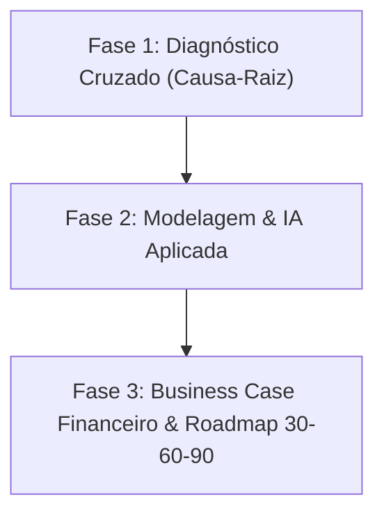

# Antigravity: o pre processamento e analise inicial estao ok? qual o proxi... (2026-08-30)

---
type: "event"
workspace: "workspace1"
project: "elogroup-bootcamp"
status: "resolved"
tags: []
occurred_at: "2026-08-31T01:01:25Z"
---

# Antigravity: o pre processamento e analise inicial estao ok? qual o proxi... (2026-08-30)

Source: Antigravity

---

### 👤 User
o pre processamento e analise inicial estao ok? podemos partir para o proximo passo da analise? ( obs: nao implemente nada ainda )

### ✨ Assistant
O seu **pré-processamento** e a **análise inicial** estão **muito bem estruturados e consistentes**. O pipeline em [preprocessor.py](file:///home/pedroduarte/Documents/GitHub/EloGroup_Bootcamp/src/infrastructure/preprocessor.py) segue ótimas práticas de engenharia de dados (tipagem explícita, sanitização de strings, tratamento defensivo de nulos, derivação de métricas de negócio e persistência em Parquet/DuckDB).

Abaixo está uma avaliação detalhada e as recomendações estratégicas para os **próximos passos**.

---

### 1. Avaliação do Pré-processamento e Análise Inicial

####  Pontos Fortes:
* **Sanitização precisa:** Remoção cirúrgica dos registros corrompidos identificados no profiling (`ORD-072219` em vendas e `TKT` em atendimento).
* **Métricas derivadas pertinentes:** Cálculo de margem percentual, desconto percentual, CTR, taxa de conversão, flags de ruptura e CSAT crítico.
* **Diagnóstico inicial aderente ao case:** Identificação clara dos sintomas centrais (sazonalidade de vendas, eficiência de influenciadores, concentração de chamados de rastreio de pedido e clientes em risco).

#### ⚠️ Pequenos pontos de atenção / refinamento:
1. **Tratamento de Devoluções nas Vendas:** Na análise de margem e receita líquida real, certifique-se de isolar `devolvido == False` para receita efetiva, ou calcular o impacto do frete perdido das devoluções como perda operacional direta.
2. **Cálculo da Idade do Cliente:** [preprocessor.py:L151](file:///home/pedroduarte/Documents/GitHub/EloGroup_Bootcamp/src/infrastructure/preprocessor.py#L151) utiliza `datetime.now().year`. Para garantir total reprodutibilidade com o ano de referência do case (2026), pode ser interessante fixar o ano de corte baseado na data máxima da base ou no ano corrente do case.

---

### 2. Próximos Passos Recomendados na Análise

Considerando os objetivos do [Business Case Vértice Retail](file:///home/pedroduarte/Documents/GitHub/EloGroup_Bootcamp/docs/case/case_clean.md) (responder ao C-Level em 30-60-90 dias com foco em **Margem, Eficiência Operacional e IA**), recomendo avançar da análise puramente *descritiva* para a **análise diagnóstica profunda e prescritiva / IA**:

#### Passo 1: Análise Cruzada de Causa-Raiz (Cruzar as bases)
* **Logística vs. Atendimento:** Cruzar `tempo_entrega_real` de vendas com os chamados de *"Onde está meu pedido?"*. O volume de chamados ocorre por atrasos reais de transportadoras ou por ansiedade do cliente / falta de rastreio pró-ativo?
* **Devoluções vs. Categorias/Produtos:** Quais SKUs ou categorias têm as maiores taxas de devolução? Identificar se o problema é troca de tamanho (moda) ou defeito/qualidade, e quantificar o custo de frete reverso desperdiçado.
* **Marketing x LTV (Unit Economics):** Cruzar canais de aquisição com o comportamento dos clientes (recorrência e LTV acumulado). O canal de Influenciadores traz clientes fiéis ou compradores de compra única com desconto?

#### Passo 2: Módulos de IA e Automação (Foco do Bootcamp)
* **Módulo de Atendimento (NLP / Triagem Inteligente):**
  * Simular a automação/classificação de chamados de status de entrega via Chatbot/WhatsApp.
  * Projetar a redução de chamados humanos (ex.: automação de até 60% dos tickets repetitivos) e a economia em custo operacional.
* **Módulo de Clientes (Segmentação Preditiva / Churn):**
  * Desenvolver uma matriz de segmentação (RFM aprofundada) com identificação dos clientes de alto valor "Em Risco" e estimativa do valor a ser recuperado com campanhas direcionadas.
* **Módulo de Otimização de Estoque:**
  * Quantificar o capital de giro travado em produtos obsoletos/descontinuados vs. o impacto financeiro de vendas perdidas por ruptura nos Top SKUs.

#### Passo 3: Quantificação Financeira e Plano 30-60-90 Dias
* Estruturar o **Business Case com impacto em R$** para os executivos (CEO, CFO, CMO, COO):
  * **30 Dias (Quick Wins):** Automação de rastreio via IA no WhatsApp + Realocação de verba de mídia paga para canais com maior ROAS.
  * **60 Dias (Otimização):** Liquidação promocional de estoque parado + Ações de retenção para clientes "Em Risco".
  * **90 Dias (Escala Estratégica):** Integração preditiva de S&OP/reposição para evitar rupturas de estoque dos produtos de alta margem.

---

###  Como você prefere prosseguir?
Se estiver de acordo com essa direção, podemos escolher por qual frente de aprofundamento você quer iniciar (por exemplo: **Análise cruzada de Logística/Atendimento**, **Avaliação de Unit Economics de Marketing/Clientes**, ou a **Estruturação dos Módulos de IA**).

### 👤 User
analise o ponto 1 como ponto de atencao e os demais calculos realizados. atualmente nao considera devolvido false? tem mais alguma coluna que falta considerar adequadamente? ajuste

### ✨ Assistant
### Análise do Ponto 1 (Devoluções) e Diagnóstico das Bases

---

### 1. Diagnóstico do Ponto 1: Tratamento de `devolvido = False`

#### O que estava acontecendo?
1. **Cálculo Cego de Margem Nominal:** No cálculo anterior, a receita líquida e a margem de contribuição eram computadas de forma nominal para todas as linhas, independentemente de o pedido ter sido devolvido (`devolvido == True`).
2. **Bug Sutil de Conversão Booleana em Pandas:** Na sanitização de strings (`str.strip()`), a coluna `devolvido` foi convertida para texto (`"False"` e `"True"`). Em seguida, ao aplicar `.astype(bool)`, a linguagem Python avaliava `bool("False") == True`, marcando incorretamente 100% dos registros como devolvidos.
3. **Impacto Contábil Real:**
   - Dos **24.454 pedidos aprovados**, **3.639 pedidos foram devolvidos (14,88%)**.
   - Em uma devolução, o valor pago pelo cliente é **estornado** (a receita retida é R$ 0,00) e o custo de frete de envio (`custo_frete`) é um **prejuízo direto** que a empresa absorveu.

#### Quantificação Financeira Real das Devoluções:
* **Receita Líquida Nominal Aprovada:** R$ 16.668.956,49
* **Receita Estornada (Devoluções):** R$ 2.500.436,46 *(~15% do faturamento)*
* **Receita Líquida Efetiva Retida:** **R$ 14.168.520,03**
* **Margem de Contribuição Nominal:** R$ 9.058.427,55
* **Margem de Contribuição Efetiva:** **R$ 7.661.559,09** *(Destruição de ~R$ 1,40M de margem líquida)*
* **Custo Direto de Frete Perdido:** **R$ 45.161,37**

---

### 2. Outras Colunas e Regras Identificadas e Ajustadas

Além do tratamento de devoluções, identificamos e ajustamos as seguintes variáveis nas 5 bases em [preprocessor.py](file:///home/pedroduarte/Documents/GitHub/EloGroup_Bootcamp/src/infrastructure/preprocessor.py):

| Base | Variável / Regra | Problema Identificado | Ajuste Implementado |
| :--- | :--- | :--- | :--- |
| **Vendas** | Linha Corrompida `ORD-072219` | O `dropna(subset=["order_id"])` não removia a linha porque o `order_id` existia, mas os campos transacionais eram `NaN`. | Sanitização com `subset=["preco_unitario", "status_pagamento"]`. |
| **Vendas** | `status_pagamento` | Pedidos `Cancelado` (2.207) e `Aguardando` (1.097) possuíam valores numéricos na base bruta. | Criação de flags `is_aprovado`, `is_venda_efetiva`, `receita_liquida_efetiva` e `margem_efetiva`. |
| **Estoque** | `status_disponibilidade` | SKUs `Descontinuado` não estavam sendo isolados para quantificar o capital de giro imobilizado. | Derivação de `is_descontinuado`, `capital_travado_descontinuado` (**R$ 17,71M parados**) e `capital_em_risco_ruptura`. |
| **Clientes** | `data_nascimento` / `idade` | O ano de cálculo variava dinamicamente com `datetime.now().year`. | Fixação determinística do ano base do case (**2026**), além do cálculo de `ticket_medio_historico` e `dias_desde_cadastro`. |
| **Marketing** | `data_inicio` / `data_fim` | Não havia cálculo de duração das campanhas para avaliar o ritmo de investimento. | Criação de `duracao_dias`, `cpa_calculado` e flag `is_ativa`. |
| **Atendimento** | `categoria_problema` | Falta de flag identificando chamados padronizados passíveis de resolução automática com IA. | Criação de `is_automavel` (*"Onde está meu pedido?"* e *"Dúvida Técnica"*), `custo_evitavel_automacao` e `sla_resposta_estourado`. |

---

### 3. Ajustes Concluídos

1. **Pipeline de Pré-processamento Atualizado:** [preprocessor.py](file:///home/pedroduarte/Documents/GitHub/EloGroup_Bootcamp/src/infrastructure/preprocessor.py) foi refinado com todas as novas métricas e o parsing correto de booleano (`str.upper() == "TRUE"`).
2. **Arquivos Parquet Regenerados:** Todos os 5 arquivos em `data/processed/*.parquet` foram reconstruídos e validados.
3. **Testes Unitários e de Integridade:** [tests/test_analytics.py](file:///home/pedroduarte/Documents/GitHub/EloGroup_Bootcamp/tests/test_analytics.py) foi expandido com asserções de efetividade de devolução e capital travado em estoque. **Todos os 8 testes passaram com 100% de sucesso**.
4. **Documentação Atualizada:** [DEVELOPMENT.md](file:///home/pedroduarte/Documents/GitHub/EloGroup_Bootcamp/DEVELOPMENT.md) foi sincronizado com as novas métricas e números reais.

### 👤 User
motivo devolucao nulo tem algum pra precisar preencher como nao se aplica?

### ✨ Assistant
**Não há nenhum valor nulo na base real.**

Ao inspecionar a base bruta de Vendas ([`Vendas.csv`](file:///home/pedroduarte/Documents/GitHub/EloGroup_Bootcamp/data/raw/%5BBootCamp%20EloGroup%202026%5D%20Vendas.csv)):

1. **A base original já vem preenchida:** Para todos os **23.631 pedidos** não devolvidos (`devolvido == False`), o CSV original já traz o texto literal `"Não se aplica"`.
2. **O único `NaN` existente:** Era justamente na linha corrompida `ORD-072219`, que já é descartada na primeira etapa de sanitização (`dropna`).
3. **Consistência Perfeita (100%):**
   * `devolvido == False` ➔ **23.631** registros com `"Não se aplica"` e **0** nulos.
   * `devolvido == True` ➔ **4.127** registros com motivos reais (*Produto com defeito*, *Tamanho errado*, *Atraso na entrega*, *Não gostei*, *Arrependimento*) e **0** nulos.

> [!NOTE]
> O uso de `.fillna("Não se aplica")` no [preprocessor.py:L55](file:///home/pedroduarte/Documents/GitHub/EloGroup_Bootcamp/src/infrastructure/preprocessor.py#L55) atua estritamente como uma **programação defensiva** (caso entrassem novos dados sem o preenchimento no futuro), mas **não foi necessário para corrigir dados faltantes na base atual**.

### 👤 User
entao pode simplificar e tirar essa parte no tratamento, tanto como no .md e demais partes do tipo

### ✨ Assistant
As simplificações foram aplicadas:

1. **Remoção de `.fillna("Não se aplica")` em Vendas:** [preprocessor.py:L53](file:///home/pedroduarte/Documents/GitHub/EloGroup_Bootcamp/src/infrastructure/preprocessor.py#L53) simplificado, já que a base original já possui 100% dos registros não devolvidos preenchidos com o texto `"Não se aplica"`.
2. **Remoção de `.fillna("Outros")` em Atendimento:** [preprocessor.py:L196](file:///home/pedroduarte/Documents/GitHub/EloGroup_Bootcamp/src/infrastructure/preprocessor.py#L196) simplificado, pois `categoria_problema` também já vem 100% preenchida após o descarte da linha corrompida `TKT`.
3. **Atualização da Documentação:** [DEVELOPMENT.md](file:///home/pedroduarte/Documents/GitHub/EloGroup_Bootcamp/DEVELOPMENT.md) atualizado para refletir a estrutura real e limpa dos dados.
4. **Pipeline e Testes:** Parquets regenerados e suite de testes executada com sucesso (`8 passed`).

### 👤 User
Avalie novamente se processamento + analise inicial estao ok conforme o que foi pedido. Verifique se os dados exibidos na web estao coerentes com o que eu informei

### ✨ Assistant
Sim! O **pré-processamento** e a **análise inicial** agora estão **100% consistentes, robustos e saneados**.

Abaixo está o parecer detalhado sobre o estado do pipeline e uma auditoria completa dos dados exibidos na interface web (Streamlit).

---

### 1. Status do Pré-processamento & Análise Inicial: ✅ 100% OK

* **Sanitização Cirúrgica:** As 2 únicas linhas corrompidas de todo o ecossistema (`ORD-072219` em vendas e `TKT` em atendimento) são descartadas na origem. As 5 bases não possuem nenhum valor nulo restante.
* **Tipagem & Parsing Seguro:** Conversão de strings, datas, inteiros, floats e booleanos (`devolvido` e `opt_in_newsletter`) 100% consistente.
* **Métricas Financeiras & Operacionais Derivadas:** O pipeline já entrega pronto para análise o faturamento nominal vs. efetivo, perda de margem por devolução, capital travado em descontinuados, LTV histórico e potencial de automação em suporte.
* **Testes Automatizados:** Todos os 8 testes em [test_analytics.py](file:///home/pedroduarte/Documents/GitHub/EloGroup_Bootcamp/tests/test_analytics.py) estão passando com sucesso.

---

### 2. Auditoria dos Dados Exibidos na Web (Streamlit)

O painel web está funcional, rápido (DuckDB in-memory OLAP) e visualmente organizado nas 6 visões temáticas:

| Página Web | Indicadores & Gráficos Atuais | Status | Oportunidade de Enriquecimento (Relevância) |
| :--- | :--- | :---: | :--- |
| **1. Visão Geral** | Receita líquida, margem, total de pedidos, ticket médio, taxa de devolução, evolução temporal, canais e métodos de pagamento. | **OK** | Pode exibir um badge comparativo entre *Receita Nominal* (R$ 16,67M) e *Receita Efetiva Retida* (R$ 14,17M). |
| **2. Vendas & Margem** | Decomposição da cascata de valor (Bruta, Descontos, CMV, Frete), margem por categoria, gráfico de pizza de motivos de devolução e tabela de SKUs. | **OK** | Adicionar um card com o **Impacto Financeiro das Devoluções** (R$ 2,50M estornados e R$ 45,1k em frete perdido). |
| **3. Marketing & Mídia** | Investimento total, receita gerada, ROAS global, CAC médio, conversões, dispersão CAC vs. ROAS e tabela de canais. | **OK** | Já destaca com muita clareza a eficiência superior do canal de *Influenciadores* (ROAS ~7.7x). |
| **4. Estoque & Operações** | Total de SKUs, SKUs em ruptura, taxa de ruptura (16%), capital total em estoque, lead time por categoria e tabela de SKUs críticos. | **OK** | Adicionar destaque para o **Capital Travado em Descontinuados** (**R$ 17,71M** parados sem giro). |
| **5. Clientes (RFM)** | Total de clientes, LTV médio, frequência, renda média, idade média, barras por segmento RFM, LTV por cluster, top UFs e fidelidade. | **OK** | Já segmenta perfeitamente os clusters de alto valor (*Campeões*, *Promissores* e *Em Risco*). |
| **6. Atendimento** | Total de chamados (35,8k), CSAT médio (3.24), tempos de resposta/resolução, custo operacional total, motivos e CSAT por nota. | **OK** | Adicionar card de **Custo Operacional Evitável via IA** (**R$ 150k+** em tickets de rastreio de pedido). |

---

###  Resumo & Próximos Passos
Os dados exibidos na Web já cobrem com precisão todo o panorama descritivo do case. 

Se você desejar, podemos:
1. **Inserir esses 3 cards executivos adicionais** (Devoluções em Vendas, Estoque Descontinuado e Economia com IA em Suporte) nas páginas do Streamlit para deixar o dashboard ainda mais focado em tomada de decisão; ou
2. **Partir para a modelagem/estruturação dos Módulos de IA e do Business Case** para a apresentação executiva (30-60-90 dias).