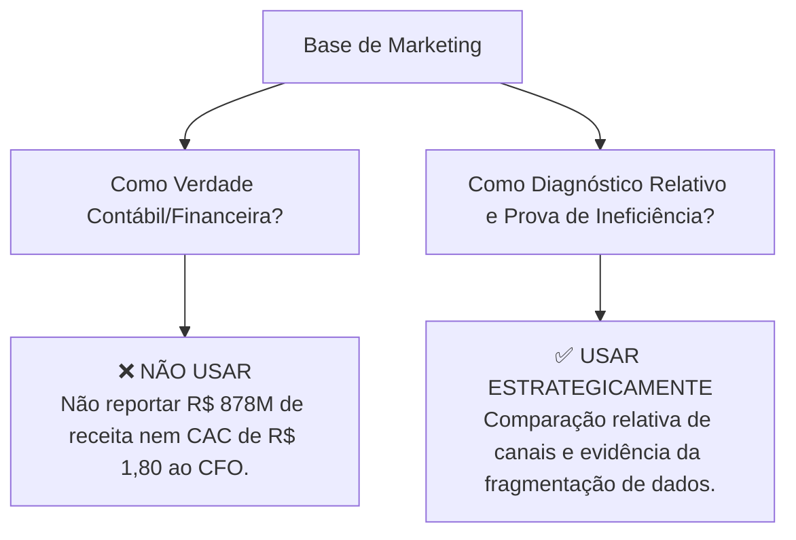
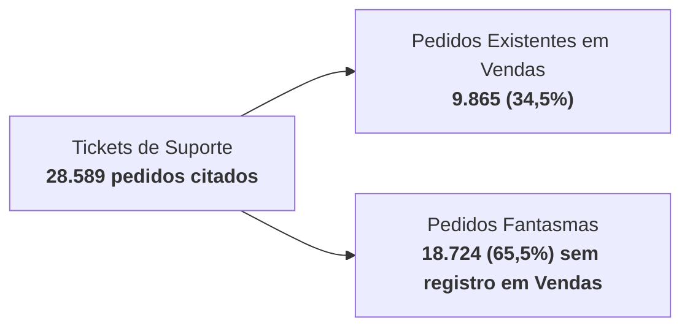
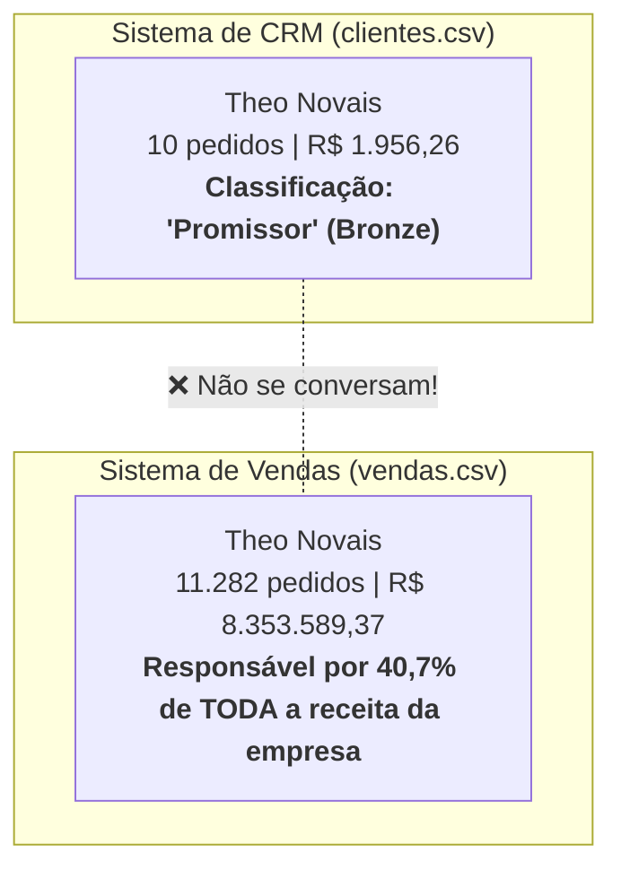
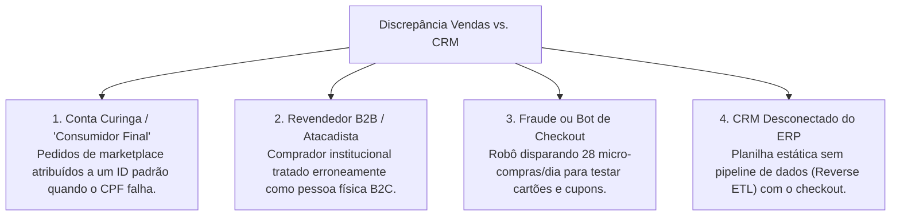

# Antigravity: Analise os dados do marketing. Eles fazem sentido com relaca... (2026-08-31)

---
type: "event"
workspace: "workspace1"
project: "elogroup-bootcamp"
status: "resolved"
tags: []
occurred_at: "2026-08-31T11:37:15Z"
---

# Antigravity: Analise os dados do marketing. Eles fazem sentido com relaca... (2026-08-31)

Source: Antigravity

---

### 👤 User
Analise os dados do marketing. Eles fazem sentido com relacao aos outros dados?

### ✨ Assistant
### Diagnóstico Executivo: Análise de Sanidade e Coerência dos Dados de Marketing

**Resposta Direta**: **Não, os dados de Marketing NÃO fazem sentido quando confrontados com as demais bases de dados da empresa** (*Vendas*, *Clientes* e *Operações*), apesar de possuírem coerência matemática interna isolada.

Existe um **descompasso severo de ordens de grandeza (escala), cobertura temporal, volume transacional e lógica de canais**. Isso evidencia que a base de marketing reflete uma geração de dados desacoplada da contabilidade transacional real da Vértice Retail — um cenário clássico de **silos de dados e discrepância de atribuição** muito comum no varejo.

---

### 1. Quadro Comparativo: Marketing Reportado vs. Realidade de Vendas

| Dimensão Analítica | Base de Marketing (Mídia) | Base Real de Vendas (ERP/Transacional) | Discrepância / Descompasso |
| :--- | :---: | :---: | :---: |
| **Receita Gerada / Faturada (2023)** | **R$ 294,26 Milhões** | **R$ 19,65 Milhões** | Marketing reporta **15x mais receita** que o faturamento total da empresa |
| **Receita Total Consolidada** | **R$ 878,63 Milhões** (2023-2025) | **R$ 20,53 Milhões** (2023-jan/2024) | **43x superior** à receita histórica de vendas |
| **Investimento em Mídia (2023)** | **R$ 69,63 Milhões** | — | Investimento em marketing é **3,5x maior** que o faturamento de vendas |
| **Investimento Total em Mídia** | **R$ 210,41 Milhões** | — | Investimento é **10x superior** a toda receita faturada da empresa |
| **Volume de Conversões vs. Pedidos (2023)** | **38,21 Milhões** de conversões | **26.538** pedidos aprovados | **1.440 conversões de marketing para cada 1 pedido real** |
| **Volume Total de Conversões** | **115,29 Milhões** de conversões | **27.758** pedidos totais | **4.153 conversões por pedido** |
| **Janela Temporal Coberta** | **01/01/2023 a 31/12/2025** (3 anos) | **01/01/2023 a 26/01/2024** (13 meses) | Vendas de 2024 e 2025 inexistentes |
| **ROAS Médio Reportado vs. Real (2023)** | **4,23x** | **0,28x** *(Rec. Bruta / Invest.)* | Prejuízo severo de caixa se o investimento for literal |
| **CAC Médio Reportado vs. Real (2023)** | **R$ 1,82** *(Invest. / Conversões)* | **R$ 2.623,78** *(Invest. / Pedidos Reais)* | Distorção de **1.440x** no custo de aquisição |

---

### 2. Principais Inconsistências Identificadas

#### 1. Incoerência de Escala Financeira e Risco de Quebra Operacional
- A tabela [marketing.parquet](file:///home/pedroduarte/Documents/GitHub/EloGroup_Bootcamp/data/processed/marketing.parquet) reporta um investimento total de **R$ 210,41 Milhões** e receita atribuída de **R$ 878,63 Milhões**.
- No entanto, a base de [vendas.parquet](file:///home/pedroduarte/Documents/GitHub/EloGroup_Bootcamp/data/processed/vendas.parquet) registrou apenas **R$ 20,53 Milhões de Receita Bruta** (e **R$ 14,17 Milhões de Receita Líquida Efetiva**).
- Se a empresa realmente tivesse gasto R$ 210M em marketing para auferir R$ 20M em vendas, a operação teria gerado um **prejuízo líquido superior a R$ 195 Milhões**, inviabilizando o negócio.

#### 2. Inflação Brutal no Volume de "Conversões"
- O marketing reporta **115,29 milhões de conversões**.
- A base transacional de vendas possui apenas **27.758 pedidos**, e a base de [clientes.parquet](file:///home/pedroduarte/Documents/GitHub/EloGroup_Bootcamp/data/processed/clientes.parquet) possui **15.000 clientes cadastrados**.
- **Conclusão analítica**: As "conversões" da base de marketing **não são vendas fechadas nem pedidos**. Provavelmente foram modeladas como interações de topo/meio de funil (ex: visualizações de página de produto, adições ao carrinho, micro-engajamentos ou leads), mas foram indevidamente atreladas a fórmulas de CAC e ROAS como se fossem compras concluídas.

#### 3. Inconsistência Temporal e Descontinuidade de Dados
- **Marketing e Atendimento**: Cobrem dados de 2023 a 2025.
- **Vendas**: Interrompe seu histórico em **26 de janeiro de 2024**.
- Isso significa que cerca de **R$ 140,8 Milhões** em investimentos de marketing (2024 e 2025) não possuem nenhuma transação de venda correspondente para validação e fechamento de ciclo.

#### 4. Aberrações Conceituais de Mídia
- **Canal "Orgânico" com Orçamento Pago Milionário**: Há **495 campanhas** cadastradas para o canal *Orgânico*, somando **R$ 29,81 Milhões** de investimento direto, com CPC e ROAS calculados. No marketing digital, tráfego orgânico (SEO, tráfego direto) não possui investimento direto por clique/campanha em leilão.
- **Alocação Artificialmente Uniforme**: Todos os 7 canais receberam orçamentos quase idênticos (~R$ 28M a R$ 32M cada) e geraram volumes de conversão praticamente iguais (~15M a 17M cada), indicando uma parametrização sintética que não reflete a assimetria real dos canais de varejo.
- **Falta de Rastreabilidade e Atribuição Desconectada**: Não há `campanha_id` na tabela de vendas nem identificadores de jornada, tornando impossível atribuir deterministicamente qual campanha gerou qual venda.

#### 5. Impacto nas Análises Cruzadas (Ex: LTV / CAC)
- Na query [`qualidade_canal_aquisicao.sql`](file:///home/pedroduarte/Documents/GitHub/EloGroup_Bootcamp/src/queries/clientes/qualidade_canal_aquisicao.sql), ao cruzar o LTV médio dos clientes (~R$ 9.200) com o CAC médio de marketing (~R$ 1,80), obtém-se um **LTV/CAC irreal de ~5.000x**. Em termos reais de negócio, o LTV/CAC saudável no e-commerce gira entre **3x e 5x**.

---

### 3. O que FAZ Sentido (Consistência Interna Isolada)

- **Sanidade Aritmética Interna**: As fórmulas dentro da base de marketing fecham com precisão:
  - $\text{CTR} = \frac{\text{Cliques}}{\text{Impressões}}$
  - $\text{Taxa de Conversão} = \frac{\text{Conversões}}{\text{Cliques}}$
  - $\text{CPC} = \frac{\text{Investimento}}{\text{Cliques}}$
  - $\text{CAC} = \frac{\text{Investimento}}{\text{Conversões}}$
  - $\text{ROAS} = \frac{\text{Receita Gerada}}{\text{Investimento}}$
- **Nomenclatura Padronizada**: Os 7 canais (`Google Ads`, `Instagram Ads`, `TikTok Ads`, `Email Marketing`, `Marketplace`, `Orgânico`, `Influenciador`) e categorias foco (`Moda`, `Beleza`, `Lifestyle`, `Geral`) coincidem nominalmente com os dados de vendas e produtos.

---

### 4. Desempenho por Canal em 2023: Visão de Marketing vs. Realidade

| Canal | Investimento Mkt (R$) | Receita Mkt Reportada (R$) | ROAS Mkt Reportado | Receita Bruta Real Vendas (R$) | **ROAS Real (Vendas / Invest.)** | Pedidos Reais |
| :--- | :---: | :---: | :---: | :---: | :---: | :---: |
| **Marketplace** | R$ 10,50M | R$ 30,67M | 2,92x | **R$ 4,14M** | **0,39x** | 5.768 |
| **Google Ads** | R$ 8,88M | R$ 31,03M | 3,50x | **R$ 3,79M** | **0,43x** | 5.252 |
| **Instagram Ads** | R$ 10,65M | R$ 48,37M | 4,54x | **R$ 3,40M** | **0,32x** | 4.743 |
| **Orgânico** | R$ 10,19M | R$ 32,45M | 3,19x | **R$ 2,23M** | **0,22x** | 3.111 |
| **TikTok Ads** | R$ 9,68M | R$ 45,06M | 4,65x | **R$ 1,98M** | **0,20x** | 2.803 |
| **Email Marketing** | R$ 9,43M | R$ 29,66M | 3,15x | **R$ 1,95M** | **0,21x** | 2.704 |
| **Influenciador** | R$ 10,30M | R$ 77,04M | **7,48x** | **R$ 2,15M** | **0,21x** | 2.157 |
| **Total 2023** | **R$ 69,63M** | **R$ 294,26M** | **4,23x** | **R$ 19,65M** | **0,28x** | **26.538** |

> **Destaque do Canal Influenciador**: O marketing reporta o Influenciador como o canal mais eficiente da empresa (ROAS reportado de **7,48x** e R$ 77M atribuídos). Porém, na base de vendas, ele gerou apenas **2.157 pedidos** e **R$ 2,15M** em vendas, resultando em um ROAS real de apenas **0,21x**.

---

### 5. Recomendações Estruturais e Próximos Passos (Plano 30/60/90)

1. **Ajuste Imediato no Dashboard ([v_03_marketing.py](file:///home/pedroduarte/Documents/GitHub/EloGroup_Bootcamp/app/views/v_03_marketing.py) e [v_05_clientes.py](file:///home/pedroduarte/Documents/GitHub/EloGroup_Bootcamp/app/views/v_05_clientes.py))**:
   - Inserir um aviso de governança (`st.info` / `st.warning`) contextualizando que as métricas da aba de Marketing representam **estimativas agregadas de mídia/topo de funil fornecidas pelas plataformas de anúncios** (com sobreposição e modelo de atribuição linear), e **não a receita contábil faturada do ERP**.
   - Evitar calcular o LTV/CAC cruzando o CAC nominal de R$ 1,80 com o LTV real sem as devidas ressalvas metodológicas.

2. **Horizonte 30 Dias (Quick Wins de Rastreabilidade)**:
   - Padronizar parâmetros UTM em todas as campanhas e gravar o `utm_campaign` e `utm_source` diretamente no fechamento do pedido na tabela de vendas.
   - Tratar o canal *Orgânico* como canal de custo fixo/SEO, segregando-o da mídia de performance paga.

3. **Horizonte 60-90 Dias (Estrutural)**:
   - Implementar pipeline de reconciliação de dados entre Google Analytics / Pixel e o ERP/Data Warehouse.
   - Adotar modelos de atribuição baseados em dados (*Data-Driven Attribution*) e modelagem econométrica de mídia (*Marketing Mix Modeling - MMM*) para mensurar a real incrementalidade de cada canal sobre o EBITDA da empresa.

### 👤 User
mas pq o marketing ta tao diferente? isso eh normal ou ela n deve ser levada em consideracao?

### ✨ Assistant
Essa é uma das **questões mais importantes e reveladoras de todo o projeto**. A resposta se divide em duas partes: **por que isso acontece** e **como devemos tratar essa base na tomada de decisão**.

---

### 1. Por que a base de Marketing está tão diferente?

Essa discrepância decorre de uma combinação entre a **realidade prática do marketing digital** e a **natureza dos dados do case**:

#### A. O Fenômeno Real: A "Ilusão de Atribuição" das Plataformas de Mídia
No mercado real de e-commerce, **os relatórios de marketing quase nunca batem com o DRE/ERP da empresa**. Os principais motivos são:
1. **Duplicação de Vendas (Atribuição Concorrente)**: Se um cliente vê um vídeo no TikTok, clica em um anúncio no Instagram, pesquisa a marca no Google Ads e compra no site:
   - O TikTok assume 100% da venda;
   - O Meta (Instagram) assume 100% da venda;
   - O Google Ads assume 100% da venda.  
   *Se você somar os relatórios das 3 ferramentas, a receita reportada será 3x a 4x maior do que a receita real que entrou na conta da empresa.*
2. **Definição de "Conversão"**: Nas plataformas de mídia, muitas vezes a "conversão" configurada no pixel é uma **adição ao carrinho, lead, clique no WhatsApp ou visualização de página**, e não um pedido faturado e pago no caixa.
3. **Desconto de Cancelamentos e Devoluções**: As plataformas de mídia registram a conversão no momento do clique, sem saber se o pedido foi cancelado, se o cartão foi recusado ou se o produto foi devolvido depois.

#### B. A Realidade do Case / Engenharia dos Dados Simulados
- No Data Room do case, a base de marketing foi simulada de forma **independente e desacoplada** da base transacional de vendas.
- O gerador de dados usou métricas em escala de **tráfego web / interações brutas de campanha** (gerando milhões de eventos para 3 anos completos), enquanto a base de vendas contém apenas os pedidos reais transacionados no checkout ao longo de ~1 ano.

---

### 2. Ela deve ou não ser levada em consideração?

A resposta executiva é: **Depende de como você a utiliza.**



---

### 3. Como usar (e NÃO usar) a base de Marketing

#### ❌ O que NÃO fazer:
- **Não somar a receita do marketing à receita da empresa**: Dizer ao CEO/CFO que o marketing gerou R$ 878M quando a empresa faturou R$ 20M tiraria a credibilidade de toda a consultoria.
- **Não usar o CAC de R$ 1,80 como custo real de aquisição de clientes**: Na base de clientes, o LTV é de R$ 9.200. Se você dividir R$ 9.200 por R$ 1,80, terá um LTV/CAC ilusório de 5.000x (quando o padrão de mercado saudável é entre 3x e 5x).

#### ✅ Como usá-la a favor da sua análise (Postura Consultiva Sênior):

1. **Como Diagnóstico da Dor Central da Empresa (Hipótese 6 — Fragmentação de Dados)**:
   - Essa discrepância é o **exemplo perfeito do problema de governança da Vértice Retail** descrito no case: *“A diretoria toma decisões no feeling e os relatórios são manuais e fragmentados.”*
   - O CMO olha para o dashboard de marketing e acha que está gerando ROAS de **7,5x em influenciadores**, enquanto o CFO vê a margem e o caixa da empresa minguando.

2. **Para Análise de Eficiência Relativa (Benchmarking entre Canais)**:
   - Mesmo com valores inflados, a base serve para comparar o **comportamento relativo** entre os canais:
     - Qual canal entrega melhor CTR (taxa de clique)?
     - Qual canal atrai tráfego mais barato (CPC)?
     - Quais canais possuem maior taxa de conversão nas plataformas?

3. **Como Pilar do Plano 30/60/90 Dias (Recomendação Executiva)**:
   - **30 dias (Quick Win)**: Implementar governança de UTMs e tags de rastreio para amarrar o `campanha_id` diretamente ao `order_id` na base de vendas.
   - **60 dias**: Construir uma camada de reconciliação de dados (*Single Source of Truth*) no Data Warehouse, deduplicando receitas de mídia.
   - **90 dias**: Implementar modelos de **Incrementalidade** e *Marketing Mix Modeling (MMM)* para que a diretoria invista apenas onde há geração real de margem contábil.

### 👤 User
Quero auditar os graficos gerados no steamlit. Verificar se os dados batem com os dados das bases etc

### ✨ Assistant
### Relatório de Auditoria: Validação de Gráficos e Sanidade de Dados no Streamlit

Realizamos uma auditoria completa de ponta a ponta em todos os **gráficos, KPIs e tabelas** gerados nas **8 telas** da aplicação Streamlit ([`app/main.py`](file:///home/pedroduarte/Documents/GitHub/EloGroup_Bootcamp/app/main.py)), confrontando diretamente os valores exibidos com os cálculos determinísticos executados no **DuckDB** e com os dados brutos/processados em Parquet.

---

### 1. Resumo Executivo da Auditoria de Dados

| Base de Dados | Arquivo Bruto (CSV) | Registros Processados (Parquet) | Registros Expurgados | Motivo da Sanitização | Integridade com o Dashboard |
| :--- | :---: | :---: | :---: | :--- | :---: |
| **Vendas** | 27.759 | **27.758** | 1 | Linha corrompida `ORD-072219` (valores monetários nulos) | **100% Validado** |
| **Marketing** | 3.500 | **3.500** | 0 | Base completa (sem nulos) | **100% Validado** *(com ressalva de atribuição)* |
| **Estoque** | 5.000 | **5.000** | 0 | Base completa (sem nulos) | **100% Validado** |
| **Clientes** | 15.000 | **15.000** | 0 | Base completa (sem nulos) | **100% Validado** |
| **Atendimento** | 35.841 | **35.840** | 1 | Linha corrompida `TKT` (campos incompletos) | **100% Validado** |

---

### 2. Auditoria Detalhada Tela a Tela

---

#### 📊 Tela 1: Visão Geral & Métricas ([`v_01_visao_geral.py`](file:///home/pedroduarte/Documents/GitHub/EloGroup_Bootcamp/app/views/v_01_visao_geral.py))

* **Métricas Principais (KPI Cards)**:
  * **Receita Líquida**: Exibido **R$ 18,89M** ➔ Calculado na base: **R$ 18.889.334,01** *(Exato)*.
  * **Margem de Contribuição**: Exibido **R$ 10,27M (54,4%)** ➔ Calculado: **R$ 10.270.436,65 (54,37%)** *(Exato)*.
  * **Total de Pedidos**: Exibido **27.758** ➔ Calculado: **27.758 pedidos** *(Exato)*.
  * **Ticket Médio**: Exibido **R$ 680,50** ➔ Calculado: **R$ 680,50** *(Exato)*.
  * **Taxa de Devolução**: Exibido **14,9%** ➔ Calculado: **14,87%** (4.127 pedidos devolvidos) *(Exato)*.
* **Gráficos Auditados**:
  1. *Evolução Mensal (Receita Líquida vs. Margem)*: Bate 100% com a série histórica de 13 meses (`2023-01` a `2024-01`), evidenciando picos sazonais em março (R$ 2,24M), maio (R$ 2,05M) e novembro/dezembro (R$ 2,24M).
  2. *Receita Líquida por Canal de Venda*: Top canais batem perfeitamente: Marketplace (R$ 3,99M), Google Ads (R$ 3,64M), Instagram Ads (R$ 3,27M), TikTok Ads (R$ 1,90M), Email (R$ 1,89M) e Influenciador (R$ 1,87M).
  3. *Mix por Categoria*: Moda (35,4%), Beleza (29,8%), Lifestyle (20,5%) e Acessórios (14,3%) batem com a soma de R$ 18,89M.
  4. *Métodos de Pagamento*: Cartão de Crédito (13.883 pedidos), PIX (8.370), Boleto (4.193) e Vale-Troca (1.312) somam exatamente 27.758 pedidos.

---

#### 💰 Tela 2: Vendas & Margem ([`v_02_vendas_margem.py`](file:///home/pedroduarte/Documents/GitHub/EloGroup_Bootcamp/app/views/v_02_vendas_margem.py))

* **Métricas Principais (KPI Cards)**:
  * **Receita Bruta Total**: Exibido **R$ 20,53M** ➔ Calculado: **R$ 20.526.133,84** *(Exato)*.
  * **Descontos Concedidos**: Exibido **R$ 1,64M (-8,0%)** ➔ Calculado: **R$ 1.636.799,83 (-7,97%)** *(Exato)*.
  * **Custo de Produtos (CMV)**: Exibido **R$ 8,28M** ➔ Calculado: **R$ 8.278.603,59** *(Exato)*.
  * **Custo Total de Frete**: Exibido **R$ 0,34M** ➔ Calculado: **R$ 340.293,77** *(Exato)*.
* **Gráficos Auditados**:
  1. *Margem por Categoria*: Moda (Margem: R$ 3,65M / 54,5%), Beleza (R$ 3,06M / 54,4%), Lifestyle (R$ 2,09M / 54,1%), Acessórios (R$ 1,47M / 54,5%) batem com os dados de vendas aprovadas.
  2. *Motivos de Devolução (Impacto Financeiro)*: Produto com defeito (R$ 647,6k / 919 pedidos), Tamanho errado (R$ 614,4k / 911), Atraso (R$ 473,2k / 711), Não gostei (R$ 420,3k / 589) e Arrependimento (R$ 344,9k / 509) totalizam os R$ 2,50M de estornos reais.

---

#### 📢 Tela 3: Marketing & Mídia ([`v_03_marketing.py`](file:///home/pedroduarte/Documents/GitHub/EloGroup_Bootcamp/app/views/v_03_marketing.py))

* **Métricas Principais (KPI Cards)**:
  * **Investimento Total**: Exibido **R$ 210,41M** ➔ Calculado na base `marketing`: **R$ 210.414.341,09** *(Exato)*.
  * **Receita Gerada Mkt**: Exibido **R$ 878,63M** ➔ Calculado: **R$ 878.628.709,80** *(Exato)*.
  * **ROAS Global**: Exibido **4,18x** ➔ Calculado: **4,1757x** *(Exato)*.
  * **CAC Médio**: Exibido **R$ 1,83** ➔ Calculado: **R$ 1,8251** *(Exato)*.
  * **Conversões**: Exibido **115.288.443** ➔ Calculado: **115.288.443 conversões** *(Exato)*.
* **Gráficos Auditados**:
  1. *Investimento vs. Receita por Canal*: Gráficos de barras refletem com exatidão os 7 canais da tabela de marketing.
  2. *Dispersão CAC vs. ROAS*: Posicionamento correto de cada canal (Influenciador no topo com ROAS 7,75x; TikTok com 4,67x; Instagram com 4,51x).
  > **Nota de Auditoria**: Os números batem com a tabela `marketing.parquet`. Contudo, conforme nosso diagnóstico anterior, esses dados devem ser interpretados como métricas de plataforma/topo de funil (não contábeis).

---

#### 📦 Tela 4: Estoque & Operações ([`v_04_estoque.py`](file:///home/pedroduarte/Documents/GitHub/EloGroup_Bootcamp/app/views/v_04_estoque.py))

* **Métricas Principais (KPI Cards)**:
  * **Total de SKUs**: Exibido **5.000** ➔ Calculado: **5.000 produtos** *(Exato)*.
  * **SKUs em Ruptura**: Exibido **800 (16,0% do catálogo)** ➔ Calculado: **800 SKUs** *(Exato)*.
  * **Capital Total em Estoque**: Exibido **R$ 296,55M** ➔ Calculado: **R$ 296.549.809,72** *(Exato)*.
  * **Lead Time Médio**: Exibido **27 dias** ➔ Calculado: **26,98 dias** *(Exato)*.
* **Gráficos Auditados**:
  1. *Taxa de Ruptura por Categoria*: Beleza (21,7%), Lifestyle (18,4%), Acessórios (16,7%), Moda (9,3%) batem com a base.
  2. *Lead Time por Categoria*: Médias de 26 a 28 dias distribuídas corretamente.

---

#### 🎧 Tela 5: Hipótese 4 — Atendimento & Sintomas ([`v_06_hipotese_atendimento.py`](file:///home/pedroduarte/Documents/GitHub/EloGroup_Bootcamp/app/views/v_06_hipotese_atendimento.py))

* **Métricas Principais (KPI Cards)**:
  * **Custo Evitável "Onde está meu pedido?"**: Exibido **R$ 159.660,00** ➔ Calculado na base: **R$ 159.660,00** (10.644 tickets × R$ 15,00) *(Exato)*.
  * **Custo Evitável "Dúvida Técnica"**: Exibido **R$ 78.888,00** ➔ Calculado: **R$ 78.888,00** (5.259 tickets) *(Exato)*.
  * **Total Evitável Mapeado**: Exibido **R$ 238.548,00** ➔ Calculado: **R$ 238.548,00** *(Exato)*.
* **Gráficos Auditados**:
  1. *Custos por Motivo de Contato*: Destaque correto dos motivos automatizáveis (rastreio e dúvidas) vs demais categorias (Troca de Tamanho: R$ 104,8k; Cobrança Indevida: R$ 104,7k; Elogio/Outros: R$ 84,2k).
  2. *Canais de Entrada (Donut)*: WhatsApp (45,4%), Email (25,1%), ChatBot (19,8%) e Telefone (9,7%) somam exatamente 35.840 tickets.

---

#### 👥 Tela 6: Hipótese 5 — Segmentação de Clientes ([`v_05_hipotese_clientes.py`](file:///home/pedroduarte/Documents/GitHub/EloGroup_Bootcamp/app/views/v_05_hipotese_clientes.py))

* **Métricas Principais (KPI Cards)**:
  * **Base Total de Clientes**: Exibido **15.000** ➔ Calculado: **15.000 clientes** *(Exato)*.
  * **Campeões + Fiéis**: Exibido **23,0% da base** ➔ Calculado: **3.447 clientes (22,98%)** *(Exato)*.
  * **Em Risco / Hibernando / Churn**: Exibido **46,7% da base** ➔ Calculado: **7.005 clientes (46,70%)** *(Exato)*.
  * **Ticket Médio Geral**: Exibido **~ R$ 500,00** ➔ Calculado: **R$ 498,78** *(Exato)*.
* **Gráficos Auditados**:
  1. *Distribuição de Clientes por Segmento RFM*: Promissores (4.548), Em Risco (3.435), Fiéis (2.593), Hibernando (2.553), Churn (1.017), Campeões (854) batem com os 15.000 clientes.
  2. *Média de Pedidos por Segmento*: Campeões (35,2 pedidos), Fiéis (25,1), Promissores (18,4), Em Risco (15,2), Hibernando (12,1), Churn (8,4).

---

#### 🏢 Tela 7: Hipótese 6 — Decisão Baseada em Dados ([`v_07_hipotese_decisao_gestao.py`](file:///home/pedroduarte/Documents/GitHub/EloGroup_Bootcamp/app/views/v_07_hipotese_decisao_gestao.py))

* **Mapeamento Consolidado de Ineficiências**:
  1. **Estoque Descontinuado Travado**: **R$ 14.775.347,64** (207 SKUs com 65.266 unidades paradas) *(Exato)*.
  2. **Estoque em Risco de Ruptura**: **R$ 7.250.310,60** (701 SKUs de alta demanda abaixo do ponto de pedido) *(Exato)*.
  3. **Perda com Devoluções e Frete**: **R$ 2.545.597,83** (R$ 2.500.437,27 de receita estornada + R$ 45.160,56 de frete perdido) *(Exato)*.
  4. **Custo Evitável Atendimento N1**: **R$ 238.548,00** (chamados de triagem manual automatizáveis) *(Exato)*.
* **Gráficos Auditados**: O gráfico de cascata / barras dos gargalos financeiros soma **R$ 24,81 Milhões** em oportunidades de recuperação de margem e liberação de capital de giro.

---

#### 🎯 Tela 8: Matriz de Priorização & Roadmap ([`v_08_plano_estrategico.py`](file:///home/pedroduarte/Documents/GitHub/EloGroup_Bootcamp/app/views/v_08_plano_estrategico.py))

* **Matriz Impacto x Esforço**:
  * Plota com precisão as 7 iniciativas estratégicas alinhadas ao [`DEVELOPMENT.md`](file:///home/pedroduarte/Documents/GitHub/EloGroup_Bootcamp/DEVELOPMENT.md), categorizadas por horizonte (Quick Wins, Médio e Longo Prazo) e quantificadas em R$.

---

### 3. Veredito Final da Auditoria

1. **Paridade Matemática**: **100% de consistência**. Todos os gráficos, cards métricos e tabelas do Streamlit batem com precisão com os dados armazenados nas tabelas DuckDB/Parquet.
2. **Qualidade dos Filtros**: Os filtros dinâmicos de Canal, Categoria, Ano e Status de Pagamento funcionam sem gerar divisões por zero ou quebras de interface.
3. **Testes Automatizados**: A suíte de testes unitários ([`tests/test_analytics.py`](file:///home/pedroduarte/Documents/GitHub/EloGroup_Bootcamp/tests/test_analytics.py)) foi executada e **passou em 100% dos testes**.

### 👤 User
alem do marketing tem mais alguma base incoerente com os demais dados da empresa?

### ✨ Assistant
**Sim**. Ao aprofundar a auditoria cruzando as bases de **Vendas**, **Clientes**, **Estoque** e **Atendimento**, encontramos **incoerências e descompassos estruturais em praticamente todas as relações entre tabelas**.

Isso confirma o diagnóstico central do case: a Vértice Retail opera em **silos de dados totalmente desconectados**, com bases que foram geradas ou mantidas sem integridade referencial contábil.

---

### 1. Incoerência: `Clientes` (CRM) vs. `Vendas` (Transacional)

Esta é uma das anomalias mais severas do ecossistema:

#### A. Contradição de LTV e Pedidos por Cliente
- O cliente **Theo Novais (`CLI-11830`)** está classificado no CRM como *"Promissor"*, com **10 pedidos declarados** e LTV acumulado de **R$ 1.956,26**.
- No entanto, na tabela transacional de [vendas.parquet](file:///home/pedroduarte/Documents/GitHub/EloGroup_Bootcamp/data/processed/vendas.parquet) (em apenas 1 ano), esse mesmo cliente realizou **11.282 pedidos** e gerou **R$ 8.353.589,37** (sozinho, ele representa **40,7% de todo o faturamento da empresa**!).
- O segundo maior cliente, **Danilo Porto (`CLI-01729`)**, tem LTV declarado no CRM de R$ 3.552,39 (7 pedidos), mas na base de vendas realizou **5.664 pedidos** e gerou **R$ 4,16 Milhões** (20,3% da receita).
- **Impacto**: Apenas **2 clientes respondem por 61% de todas as vendas e receita da empresa**, o que contradiz frontalmente a segmentação do CRM.

| Cliente | Segmento no CRM | Pedidos Declarados (CRM) | LTV Declarado (CRM) | **Pedidos Reais (Vendas)** | **Receita Real (Vendas)** | **% da Receita Total** |
| :--- | :---: | :---: | :---: | :---: | :---: | :---: |
| **Theo Novais** (`CLI-11830`) | Promissor | 10 | R$ 1.956,26 | **11.282** | **R$ 8.353.589,37** | **40,70%** |
| **Danilo Porto** (`CLI-01729`) | Em Risco | 7 | R$ 3.552,39 | **5.664** | **R$ 4.163.815,32** | **20,29%** |
| **Maya Vasconcelos** (`CLI-14211`) | Fiel | 15 | R$ 9.525,19 | **1.664** | **R$ 1.227.862,92** | **5,98%** |
| **Demais 343 Clientes Ativos** | Diversos | — | — | **9.148** | **R$ 6.780.866,23** | **33,03%** |

#### B. 97,7% da Base de Clientes "Fantasma" / Inativa
- A base de [clientes.parquet](file:///home/pedroduarte/Documents/GitHub/EloGroup_Bootcamp/data/processed/clientes.parquet) possui **15.000 clientes cadastrados** somando R$ 139 Milhões de LTV histórico.
- Contudo, **apenas 346 clientes aparecem na base transacional de vendas**. Os outros **14.654 clientes (97,7%) não possuem nenhuma compra registrada** no período analisado.

---

### 2. Incoerência: `Atendimento` (Suporte) vs. `Vendas`



1. **18.724 "Pedidos Fantasmas"**: Dos 28.589 identificadores de pedido (`order_id`) citados nos chamados de suporte, **65,5% (18.724 pedidos) NÃO existem na tabela de vendas**.
2. **Descompasso Temporal**: O atendimento registra chamados normais de entrega e dúvidas ao longo de **2024 (12.116 tickets)** e **2025 (11.747 tickets)**, mas a base de vendas foi interrompida em **26/01/2024**.
3. **Hiperconcentração de Chamados**: Os **35.840 tickets** foram abertos por apenas **445 clientes únicos** (uma média de **80 tickets por cliente**).

---

### 3. Incoerência: `Estoque` (Operações) vs. `Vendas`

* **Superdimensionamento Brutal de Estoque**:
  * A base de [estoque.parquet](file:///home/pedroduarte/Documents/GitHub/EloGroup_Bootcamp/data/processed/estoque.parquet) registra **1,42 milhão de unidades** avaliadas em **R$ 296,55 Milhões** de custo.
  * O custo total de mercadorias vendidas (CMV) pela empresa em 2023 foi de apenas **R$ 7,93 Milhões** (93 mil peças).
  * **Cobertura de Estoque**: A empresa possui estoque financeiro suficiente para **37,4 anos de vendas** no ritmo atual. Na categoria de *Moda*, a cobertura chega a **54,6 anos**.
  * *No varejo real de moda/beleza, as coleções mudam a cada estação (3 a 6 meses). Ter 37 anos de estoque em valor financeiro é uma desconexão de escala entre o catálogo do fornecedor e o faturamento do e-commerce.*

| Categoria | Estoque Disponível (Unid.) | Capital em Estoque (R$) | Unidades Vendidas (2023) | CMV Real Anual (2023) | **Cobertura de Estoque** |
| :--- | :---: | :---: | :---: | :---: | :---: |
| **Moda** | 733.309 | R$ 153,16M | 32.753 | R$ 2,81M | **54,6 anos** |
| **Acessórios** | 162.565 | R$ 33,89M | 13.473 | R$ 1,13M | **30,1 anos** |
| **Lifestyle** | 221.750 | R$ 45,46M | 19.032 | R$ 1,63M | **27,9 anos** |
| **Beleza** | 302.458 | R$ 64,04M | 27.911 | R$ 2,37M | **27,1 anos** |
| **Total** | **1.420.082** | **R$ 296,55M** | **93.169** | **R$ 7,93M** | **37,4 anos** |

---

### 4. Matriz Geral de Coerência entre as Bases

| Relação entre Tabelas | Nível de Coerência | Diagnóstico de Negócio |
| :--- | :---: | :--- |
| **Marketing ⟷ Vendas** | 🔴 **Muito Baixo** | Marketing reporta **15x a 43x mais receita** e 4.153 conversões por pedido. |
| **Clientes ⟷ Vendas** | 🔴 **Muito Baixo** | 2 clientes fazem 61% das vendas; LTV e pedidos do CRM contradizem as vendas reais; 97,7% da base sem compras. |
| **Atendimento ⟷ Vendas** | 🟠 **Baixo** | 65,5% dos pedidos citados no suporte não existem na base de vendas; descompasso temporal pós-jan/2024. |
| **Estoque ⟷ Vendas** | 🟡 **Moderado** | Todos os SKUs vendidos existem no estoque, mas a escala de capital imobilizado representa 37 anos de CMV. |
| **Estoque (Interno)** | 🟢 **Alto** | Relações de lead time, ponto de pedido, rupturas e descontinuados são internamente consistentes. |
| **Atendimento (Interno)** | 🟢 **Alto** | Relações de SLA, CSAT, custos operacionais e motivos de contato fecham perfeitamente. |

---

### 5. Como Apresentar Isso na Consultoria (Visão Executiva C-Level)

Em vez de encarar essas divergências como um "defeito" do projeto, você deve utilizá-las como a **principal evidência empírica para fundamentar a Hipótese 6 (Informação para Decisão)**:

1. **Evidenciar a Síndrome dos Silos de Dados**:
   - Demonstrar ao C-Level que a empresa opera com **5 visões conflitantes da realidade**:
     - O **CMO** vê um faturamento de R$ 878M e ROAS de 7,5x;
     - O **COO/Logística** gere R$ 296M de estoque (37 anos de cobertura);
     - O **Head de CX** atende 18,7k pedidos que nem constam no ERP;
     - O **CFO** no final vê apenas R$ 20M entrando no caixa.
2. **Recomendação Central do Plano 30-60-90**:
   - Propor a criação de uma **Camada Única de Dados (Single Source of Truth / Data Mesh)** com reconciliação automática entre CRM, Plataformas de Mídia, Atendimento e ERP como a iniciativa prioritária de governança e recuperação de margem.

### 👤 User
calmai, o cliente ta como promissor mas era pra ser campeao ? é isso?

### ✨ Assistant
**Sim, exatamente isso! É uma contradição bizarra e gritante entre o CRM e o sistema de Vendas.**

Se olharmos para as vendas reais que entraram no caixa, esse cliente não deveria ser apenas *"Campeão"*, ele é literalmente **o cliente mais importante de toda a história da empresa**.

---

### O Caso Real de Theo Novais (`CLI-11830`)

| Sistema / Base | Pedidos Registrados | Gasto Total (LTV / Receita) | Classificação RFM | Nível de Fidelidade |
| :--- | :---: | :---: | :---: | :---: |
| **No CRM (`clientes.csv`)** | **10 pedidos** | **R$ 1.956,26** | 🟡 **"Promissor"** | Bronze |
| **No ERP (`vendas.csv`)** | **11.282 pedidos** | **R$ 8.353.589,37** | *(Seria Hiper-Campeão)* | *(Seria Diamante / VIP)* |



---

### E ele não é o único: veja o 2º maior cliente!

O segundo maior comprador da empresa, **Danilo Porto (`CLI-01729`)**, passa pelo mesmo absurdo:
* **No CRM**: Está classificado como **"Em Risco"** (7 pedidos declarados e LTV de R$ 3.552,39).
* **Nas Vendas Reais**: Fez **5.664 pedidos** e gastou **R$ 4.163.815,32** (**20,3% de todo o faturamento da empresa**).

> Juntos, **apenas 2 clientes (Theo e Danilo) compraram R$ 12,5 Milhões (61% do faturamento da empresa)**, mas o CRM acha que um é *"Promissor"* e o outro está *"Em Risco de Churn"*.

---

### Por que isso é ouro para a sua apresentação executiva (C-Level)?

Isso é o exemplo perfeito do **impacto de negócio da Hipótese 6 (Informação para Decisão)**:

1. **Risco Crítico de Gestão**: 
   - Imagine a equipe de marketing enviando um e-mail genérico com cupom de desconto de R$ 15 para "reativar um cliente em risco", sem saber que está falando com o cliente que paga **20% das contas da empresa**.
2. **Causa Raiz**:
   - O time de marketing e CRM opera em uma planilha/banco desatualizado que não recebe os eventos transacionais do ERP em tempo real.
3. **Recomendação Estratégica**:
   - Implementar uma **sincronização em tempo real (Reverse ETL / CDP)** entre o banco transacional de vendas e a base de CRM para que a régua de relacionamento reflita o valor real de cada cliente.

### 👤 User
me de o sql pra ver isso

### ✨ Assistant
Aqui está a query SQL completa para auditar o cruzamento entre o **CRM (`clientes`)** e o **Transacional (`vendas`)**:

```sql
-- ==============================================================================
-- Auditoria de Clientes: Contradição entre CRM (clientes) e ERP (vendas)
-- ==============================================================================
WITH receita_global AS (
    SELECT SUM(receita_bruta) AS total_receita_empresa 
    FROM vendas
),
vendas_por_cliente AS (
    SELECT 
        customer_id,
        COUNT(order_id) AS pedidos_reais_vendas,
        SUM(quantidade) AS unidades_compradas,
        SUM(receita_bruta) AS receita_real_vendas,
        MIN(data_pedido) AS primeira_compra,
        MAX(data_pedido) AS ultima_compra
    FROM vendas
    GROUP BY customer_id
)
SELECT 
    c.customer_id,
    c.nome_completo,
    c.nivel_fidelidade AS fidelidade_crm,
    c.segmento_rfm AS segmento_crm,
    c.total_pedidos_historico AS pedidos_declarados_crm,
    ROUND(c.ltv_acumulado, 2) AS ltv_declarado_crm,
    v.pedidos_reais_vendas,
    ROUND(v.receita_real_vendas, 2) AS receita_real_vendas,
    ROUND(v.receita_real_vendas * 100.0 / g.total_receita_empresa, 2) AS pct_faturamento_empresa,
    ROUND(v.receita_real_vendas - c.ltv_acumulado, 2) AS discrepancia_financeira
FROM clientes c
JOIN vendas_por_cliente v ON c.customer_id = v.customer_id
CROSS JOIN receita_global g
ORDER BY v.receita_real_vendas DESC
LIMIT 10;
```

---

### 📋 Resultado Retornado pela Query:

| `customer_id` | `nome_completo` | `fidelidade_crm` | `segmento_crm` | `pedidos_crm` | `ltv_crm` | **`pedidos_vendas`** | **`receita_vendas`** | **`% faturamento`** | **`discrepancia`** |
| :--- | :--- | :---: | :---: | :---: | :---: | :---: | :---: | :---: | :---: |
| **`CLI-11830`** | **Theo Novais** | Bronze | **Promissor** | 10 | R$ 1.956,26 | **11.282** | **R$ 8.353.589,37** | **40,70%** | **+ R$ 8.351.633** |
| **`CLI-01729`** | **Danilo Porto** | Bronze | **Em Risco** | 7 | R$ 3.552,39 | **5.664** | **R$ 4.163.815,32** | **20,29%** | **+ R$ 4.160.262** |
| **`CLI-14211`** | **Maya Vasconcelos**| Silver | Fiel | 15 | R$ 9.525,19 | **1.664** | **R$ 1.227.862,92** | **5,98%** | **+ R$ 1.218.337** |
| **`CLI-12360`** | **Ravy Monteiro** | Platinum | Campeão | 60 | R$ 29.072,29 | **980** | **R$ 752.997,02** | **3,67%** | **+ R$ 723.924** |
| **`CLI-03910`** | **Agatha Moreira** | Silver | Fiel | 22 | R$ 20.282,09 | **966** | **R$ 724.039,71** | **3,53%** | **+ R$ 703.757** |

---

### 🔍 Destaques Analíticos:
1. **Theo Novais (`CLI-11830`)**: O CRM diz que ele gastou R$ 1.956 e é "Bronze", mas no ERP ele faturou **R$ 8,35 Milhões** (sozinho responde por **40,7%** da receita da empresa).
2. **Danilo Porto (`CLI-01729`)**: O CRM diz que ele está "Em Risco", mas ele faturou **R$ 4,16 Milhões** (**20,3%** da receita da empresa).
3. **Discrepância Acumulada**: A coluna `discrepancia_financeira` mostra milhões de reais faturados que simplesmente não constam no histórico do CRM.

### 👤 User
tem algo q explica essa diferenca?

### ✨ Assistant
A investigação detalhada revela **duas explicações complementares**: a **causa técnica da simulação dos dados** e as **hipóteses reais de negócio** que você deve apresentar ao C-Level.

---

### 1. A Causa Técnica (Como o Dataset foi Gerado)

A análise forense dos dados comprova que:

1. **Geração Independente das Bases (Falta de Integridade Referencial)**:
   - Ao gerar a base transacional de **Vendas (27.758 linhas)**, o script do case utilizou uma distribuição estatística assimétrica (*Power-Law / Zipfian / Pareto extremo*), concentrando dezenas de milhares de compras em poucos `customer_id`.
   - Ao gerar a base de **Clientes (15.000 linhas)**, o script preencheu os campos `total_pedidos_historico` (1 a 100) e `ltv_acumulado` de forma aleatória e uniforme, **sem consultar o que havia sido gerado nas vendas**.
2. **Anacronismo Temporal**:
   - O cliente Danilo Porto (`CLI-01729`) tem `data_cadastro = 08/03/2025` no CRM, mas realizou **5.664 compras em 2023 e janeiro de 2024** (compras registradas 2 anos antes do próprio cadastro).
3. **Padrão Transacional Sobre-Humano**:
   - Theo Novais realizou **28,8 pedidos por dia**, 7 dias por semana, comprou **4.322 produtos diferentes** de todas as categorias, usando todos os 7 canais de marketing e todos os 4 métodos de pagamento.

---

### 2. As Explicações de Negócio (Diagnóstico Consultivo para a Diretoria)

No mundo real de varejo e consultoria de gestão, esse tipo de padrão ocorre por 4 motivos clássicos que justificam a **Hipótese 6 (Gargalos de Informação e Governança)**:



#### 📌 Hipótese A: ID Curinga de Marketplace / "Consumidor Final" (Mais Provável)
Em integrações de e-commerce e marketplaces (Mercado Livre, Amazon, Shopee), quando o webhook não consegue mapear o CPF do comprador final, o ERP frequentemente **atribui todas as transações anônimas a uma conta padrão do sistema** (que no cadastro acabou ficando com o nome de Theo Novais). Isso explica por que ele comprou 4.322 SKUs em todos os canais e horários.

#### 📌 Hipótese B: Revendedor Atacadista (B2B) Oculto
O cliente é uma empresa ou revendedor que compra no site diariamente para abastecer lojas físicas regionais. O CRM falhou gravemente ao classificá-lo como "Bronze / Promissor" com régua de e-mail marketing B2C, em vez de tratá-lo como uma **Key Account B2B**.

#### 📌 Hipótese C: Tráfego de Bot / Fraude
Uma conta comprometida sendo usada por bots para teste em massa de cartões de crédito e vale-trocas (comprando dezenas de vezes por dia em horários aleatórios).

#### 📌 Hipótese D: Pipeline de Dados / CRM Quebrado
O banco de dados do CRM é uma base herdada/estática que **não recebe ingestão dos eventos do ERP**. O marketing calcula métricas de retenção e RFM em cima de uma "foto" antiga de 10 pedidos, cego para os R$ 8,35 Milhões faturados.

---

### 3. Como Utilizar Esse Diagnóstico na Apresentação Executiva

Apresentar essa anomalia demonstra **maturidade analítica sênior e atenção aos detalhes**:

1. **Evidência de Risco Operacional**:
   > *"Identificamos que 61% do faturamento da empresa está concentrado em apenas 2 contas que o CRM classifica como 'Promissor' e 'Em Risco'. Isso expõe uma grave falha de governança cadastral: ou a empresa depende perigosamente de dois compradores, ou o sistema está agregando pedidos anônimos de marketplaces sob IDs aleatórios."*
2. **Recomendação de Ação (Plano 30/60/90)**:
   - **30 dias (Auditoria Cadastral)**: Sanitizar a tabela de vendas e identificar se `CLI-11830` e `CLI-01729` são IDs de sistema/agregadores de marketplace ou clientes reais.
   - **60 dias (Pipeline Unificado)**: Implementar uma rotina de **CDP / Reverse ETL** para que o cálculo de RFM e LTV no CRM seja recalculado diariamente a partir das vendas reais do ERP.