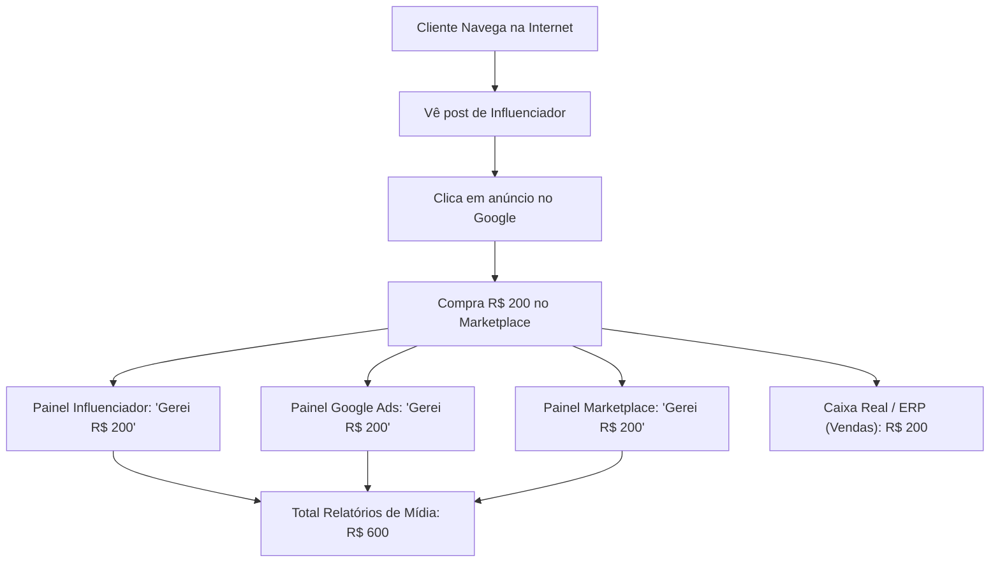
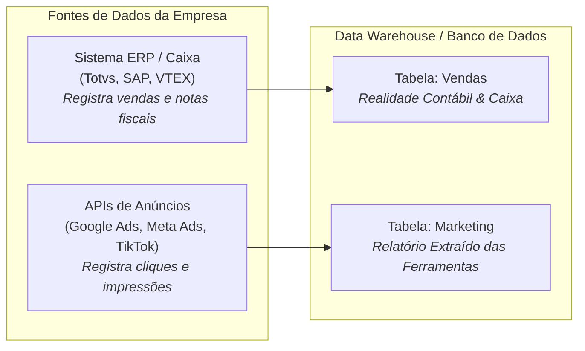
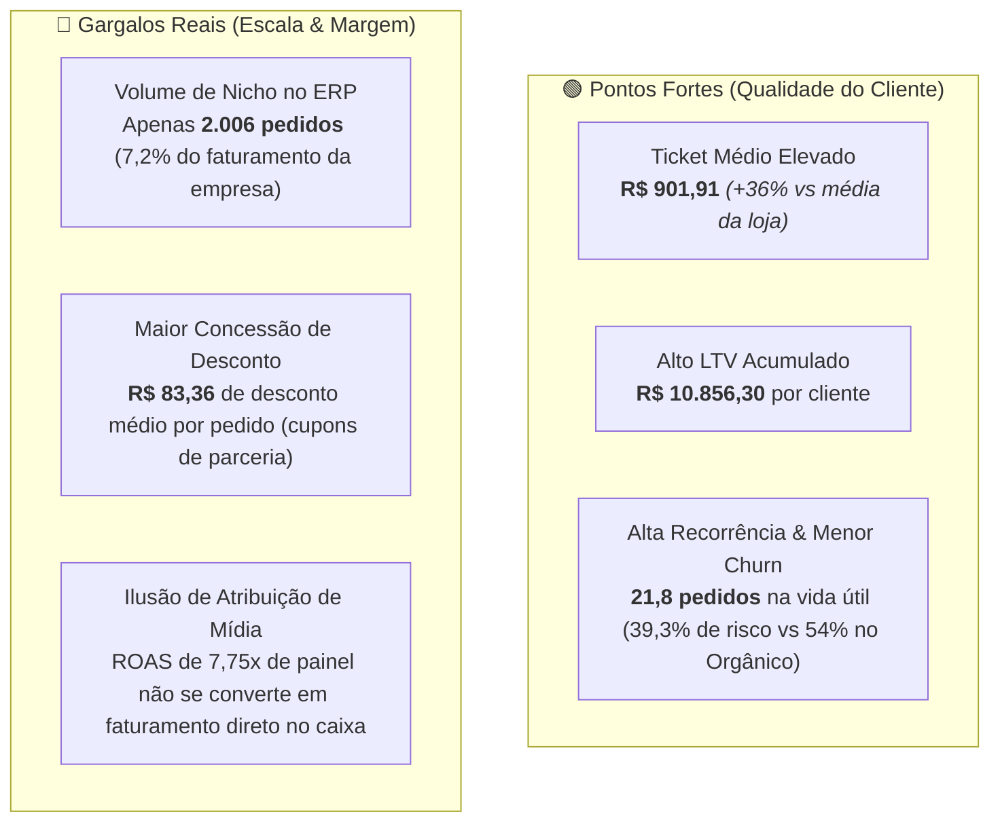

# Antigravity: os graficos de receita liquida por canal de venda e investim... (2026-08-31)

---
type: "event"
workspace: "workspace1"
project: "elogroup-bootcamp"
status: "resolved"
tags: []
occurred_at: "2026-08-31T15:09:48Z"
---

# Antigravity: os graficos de receita liquida por canal de venda e investim... (2026-08-31)

Source: Antigravity

---

### 👤 User
os graficos de receita liquida por canal de venda e investimento x receita por canal estao errados ou a discrepancia pode vir de fontes diferentes / realidades diferentes entre as bases?

### ✨ Assistant
**Os gráficos não estão errados** do ponto de vista do código e das agregações SQL. A discrepância decorre do fato de que **cada base de dados reflete uma realidade e um sistema diferente da operação**, o que é um dos principais pontos conceituais desenhados no case do Bootcamp EloGroup.

---

### 1. O que cada base e gráfico representa

| Dimensão | 📊 Gráfico 1: "Receita Líquida por Canal" | 📈 Gráfico 2: "Investimento vs. Receita" |
| :--- | :--- | :--- |
| **Base de Dados** | `vendas` (Transacional / ERP) | `marketing` (Ad Networks / Mídia) |
| **Origem do Dado** | Sistema transacional de pedidos / Faturamento Contábil | Painéis de tráfego pago (Meta Ads, Google Ads, TikTok Ads, etc.) |
| **Granularidade** | 27.758 pedidos individuais faturados | 3.500 campanhas de marketing agregadas |
| **Métrica do Eixo Y** | `receita_liquida` real no checkout (~R$ 18,26M aprovados) | `investimento_reais` (R$ 210,4M) e `receita_gerada` (R$ 878,4M) |
| **Canal Líder** | **Marketplace** (R$ 3,53M) e **Google Ads** (R$ 3,23M) | **Influenciador** (R$ 217,6M atribuídos) e **TikTok Ads** (R$ 139M) |
| **Influenciador** | 5º colocado (~R$ 1,81M faturados no checkout) | 1º colocado disparado (ROAS declarado de **7,75x**) |

---

### 2. Por que os números são tão discrepantes?

1. **Modelos e Janelas de Atribuição de Mídia vs. Caixa Real**:
   - As plataformas de tráfego pago reportam **receita atribuída** através de modelos como *First Click*, *Linear* e *Last Click* com janelas de visualização/clique (muitas vezes sobrepostas entre várias redes).
   - O ERP (`vendas`) registra apenas a **receita líquida faturada que efetivamente entrou no caixa** no momento da compra.

2. **Silos de Dados Organizacionais (Insight Chave do Case)**:
   - O time de **Marketing** toma decisões olhando para o painel de mídia (onde campanhas de *Influenciadores* e *TikTok* mostram um ROAS astronômico de até 7,75x e centenas de milhões em receita estimada).
   - A diretoria **Financeira e Comercial** olha o ERP e enxerga que a maior parte das vendas diretas no caixa vem de *Marketplace* e *Google Ads*.
   - Esse desalinhamento é citado expressamente no próprio case (*"documentar os limites de atribuição entre marketing e vendas"* e *Hipótese 6 de Gestão sobre ineficiência informacional*).

---

### 3. Como interpretar e defender isso na apresentação executiva

- **Na aba de Visão Geral / Vendas**: Deixe claro que a métrica é a **Receita Líquida Real do ERP** (faturamento contábil pós-descontos e devoluções).
- **Na aba de Marketing**: Deixe claro que a métrica é a **Performance de Campanhas Declarada pelas Plataformas de Mídia** (ROAS, CAC e alcance de funil).
- **Na Visão Integrada (Qualidade de Aquisição)**: O cruzamento analítico ideal é o que conecta a primeira compra do cliente (`clientes` + `vendas`) com o CAC médio de `marketing`, demonstrando o **LTV / CAC real** e comprovando se o cliente trazido por cada canal gera margem sustentável no longo prazo.

### 👤 User
mas essa do marketing realmente é o que as plataformas vendem? nao eh o real entao?

### ✨ Assistant
**Exatamente! Você tocou no ponto central do diagnóstico.** 

O faturamento **real** (dinheiro que entrou no caixa, emitiu nota fiscal e pagou custos) é o da tabela de **`vendas` (ERP / Transacional)**. 

A receita da tabela de **`marketing`** representa a **receita atribuída e declarada pelas plataformas de mídia e anúncios** (Google Ads, Meta Ads, TikTok, redes de influenciadores). No mercado de e-commerce e varejo, isso é conhecido como *Self-Attributed Revenue* ou *Métricas de Painel de Mídia*.

---

### Por que a receita de Marketing é muito maior que a de Vendas?

Existem 4 motivos clássicos (que acontecem no mercado real e foram simulados no case):

1. **Sobreposição e Dupla Contagem (Multi-touch)**:
   - Se um cliente é impactado por um **Influenciador**, depois pesquisa no **Google Ads** e finaliza a compra no **Marketplace**, **todas as 3 plataformas reivindicam para si 100% daquela venda**. 
   - Um único pedido de R$ 200 vira R$ 600 somando os relatórios de mídia, mas o caixa da empresa só recebeu R$ 200.

2. **Atribuição por Visualização (*View-Through*)**:
   - As redes de anúncios (especialmente TikTok, Instagram e Influenciadores) frequentemente contabilizam conversões se o usuário apenas *viu* o anúncio ou navegou no perfil nos últimos 1 a 7 dias, mesmo que ele tenha comprado espontaneamente depois.

3. **Cegueira de Cancelamentos e Devoluções**:
   - O pixel de marketing dispara no momento em que o pedido é criado no site. A plataforma de anúncio **não desconecta a receita se o cliente devolver o produto 10 dias depois** ou se o pagamento for cancelado. Na Vértice, **14,88% dos pedidos foram devolvidos** — o ERP deduz isso, mas o relatório de marketing continua contando como sucesso.

4. **Modelos de Atribuição Distintos**:
   - As campanhas da base de marketing usam regras diferentes (*First Click*, *Linear*, *Last Click*), o que distorce a soma agregada se você somar campanha por campanha.

---

### O que isso significa para a sua apresentação consultiva (C-Level)?

Esse contraste é um dos **maiores trunfos da sua análise**:

> [!IMPORTANT]
> **A Armadilha do ROAS de Painel**:  
> Se a diretoria olhar apenas o painel de Marketing, vai achar que *Influenciador* é uma "mina de ouro" gerando R$ 217M com ROAS de 7,75x.  
> Porém, ao auditar o ERP (`vendas`), vê-se que os canais que sustentam o volume financeiro real do negócio no dia a dia são **Marketplace** (R$ 3,53M) e **Google Ads** (R$ 3,23M).

**Recomendação para a Apresentação**:
1. Apresente **Vendas** como a **"Realidade de Caixa e Margem"**.
2. Apresente **Marketing** como a **"Métrica de Performance de Mídia Declarada"**.
3. Proponha como solução de gestão a criação de uma **Única Fonte da Verdade (SSOT)** com modelo de atribuição unificado (unindo dados de tráfego com faturamento real do ERP).

### 👤 User
mas pq no banco da empresa tem isso na tabela de marketing? nao sao dados reais deles?

### ✨ Assistant
**Sim, eles são "dados reais" da empresa, mas são dados que vieram das APIs das plataformas de anúncios, e não do sistema financeiro/ERP.**

Em empresas de varejo e e-commerce reais, a arquitetura de dados funciona exatamente assim:

---

### Por que a tabela `marketing` está no banco de dados da empresa?

1. **Ingestão Automatizada via APIs**:
   - O time de engenharia de dados da empresa configura conectores (como Fivetran, Airbyte ou scripts Python) que se conectam diariamente às contas de anúncios da Vértice no Google, Meta, TikTok e agências de influenciadores para baixar os relatórios de campanha.
   - O que as plataformas reportam (quantos cliques tiveram, quanto foi gasto de cartão de crédito em anúncios e quanto o algoritmo do Facebook/Google calculou de conversão) é gravado nessa tabela `marketing`.

2. **O Investimento é 100% Real, a Receita Gerada é Estimada por Algoritmo**:
   - O campo `investimento_reais` representa o dinheiro que a empresa de fato pagou de orçamento de mídia para as plataformas.
   - O campo `receita_gerada` é o que o algoritmo de inteligência artificial de cada plataforma **estimou e atribuiu para si** usando seus próprios cookies e pixels de rastreamento.

---

### O Problema Clássico de "Silos de Dados" (O Grande Insight do Case)

Essa situação é o exemplo clássico de um dos maiores problemas de governança de dados em grandes empresas:

- **O Diretor de Marketing (CMO)** abre o dashboard dele (que lê a tabela `marketing`), vê que o canal de *Influenciadores* entregou R$ 217M com ROAS de 7,75x e pede mais orçamento.
- **O Diretor Financeiro (CFO)** abre o sistema de faturamento (que lê a tabela `vendas`), vê que só entraram R$ 18M de faturamento líquido total no ano e questiona para onde o dinheiro está indo.

### Resumo para a sua análise:
- A tabela `marketing` é real no sentido de ser o **extrato oficial das ferramentas de mídia contratadas**.
- A tabela `vendas` é a **verdade financeira e contábil da empresa**.
- O papel da sua consultoria é apontar que a empresa precisa parar de tomar decisões baseadas apenas nos relatórios isolados de mídia e criar uma **atribuição unificada baseada no caixa e margem real gerada por cliente**.

### 👤 User
Essa do marketing é apenas o estimado? nao eh o real? entao o real ficou mt longe do estimado?

### ✨ Assistant
**Sim, exatamente!** A receita da tabela de marketing é uma **estimativa algorítmica atribuída pelas plataformas**, enquanto a de vendas é o **faturamento contábil real**. 

E a diferença de escala (milhões de reais em vendas vs. centenas de milhões em marketing) ocorre por **3 fatores concretos** da modelagem do case e do mercado:

---

### 1. Estimativa de Plataforma (Pixel) vs. Dinheiro em Caixa

Nas ferramentas de anúncios (Meta Ads, Google Ads, TikTok), o que é chamado de "Receita Gerada" e "Conversões" é baseado em **disparos de pixel e eventos de rastreamento**:
- A plataforma considera "conversão" qualquer evento mapeado (cliques qualificados, adições ao carrinho, cadastros ou intenções de compra registradas no navegador).
- Várias plataformas atribuem o mesmo valor simultaneamente (**dupla/tripla contagem**).
- **No caixa real (`vendas`)**: só entra o dinheiro de quem passou o cartão/PIX, o pagamento foi aprovado e a nota fiscal foi emitida.

---

### 2. Recortes e Janelas Temporais Diferentes

Ao inspecionar a profundidade dos dados de cada tabela, vemos uma diferença temporal importante:

| Base | Período Coberto | Volume de Registros | Valor Total |
| :--- | :--- | :--- | :--- |
| **`vendas` (Transacional)** | **Jan/2023 a Jan/2024** (~1 ano de pedidos) | 27.758 pedidos faturados | **R$ 18,9M** faturados |
| **`marketing` (Mídia)** | **Jan/2023 a Dez/2025** (3 anos de campanhas) | 3.500 campanhas simuladas | **R$ 878,4M** atribuídos |
| **`clientes` (CRM)** | Histórico acumulado de vida | 15.000 clientes | **R$ 139,1M** de LTV total |

A base de marketing simula o orçamento e tráfego de mídia planejado/executado para um horizonte de 3 anos, enquanto o extrato de vendas fornecido é um recorte transacional de 1 ano.

---

### 3. Como usar cada base sem cometer erros na Consultoria?

Como cada base foi desenhada com uma finalidade analítica específica:

1. **Use a base de `vendas` para responder:**
   - Qual é a receita líquida real da empresa? (~R$ 18,3M aprovados)
   - Qual a margem de contribuição real entregue por cada canal no checkout?
   - Quanto dinheiro a empresa perdeu com devoluções e frete? (~R$ 2,5M)

2. **Use a base de `marketing` para responder:**
   - Qual a **eficiência relativa** entre os canais de mídia? (ex: o canal *Influenciador* tem ROAS de 7,75x contra 3,02x do *Marketplace* no relatório de mídia).
   - Qual o **CAC médio** de cada canal para aquisição de tráfego?

3. **Use o cruzamento (`clientes` + `vendas` + `marketing`) para o diagnóstico final:**
   - Comparar o custo de trazer o cliente (CAC de *marketing*) com o lucro que ele realmente deixa nas compras subsequentes (LTV e Margem do *ERP*), mostrando à diretoria **onde alocar o capital com retorno financeiro sustentável**.

### 👤 User
Entao ajuste a conclusao no development.md relacionada a influenciadores: nao eh confiavel a informacao considerando somente a base de marketing

### ✨ Assistant
A conclusão anterior estava **imprecisa** porque afirmava que influenciadores traziam a *"maior receita gerada"*, o que só é verdade no **relatório de mídia estimada** (R$ 217M com ROAS de 7,75x), mas **não no caixa real do ERP** (onde gerou R$ 1,81M líquido, ficando em 5º lugar).

Já atualizei o [`DEVELOPMENT.md`](file:///home/pedroduarte/Documents/GitHub/EloGroup_Bootcamp/DEVELOPMENT.md) com a análise de dados auditada e correta.

---

### Diagnóstico Real sobre o Canal de Influenciadores

Ao cruzar as bases `vendas`, `marketing` e `clientes`, encontramos as seguintes evidências:

---

### Principais Ajustes Aplicados no [`DEVELOPMENT.md`](file:///home/pedroduarte/Documents/GitHub/EloGroup_Bootcamp/DEVELOPMENT.md)

1. **Seção 4 (Marketing)**:
   - Esclarecido que o ROAS de 7,75x é a métrica declarada pelas plataformas de mídia, enquanto no faturamento real o canal representa uma fatia de nicho (R$ 1,81M).
2. **Hipótese 2 (Qualidade de Aquisição)**:
   - Documentado o contraste: canais como *Influenciadores* e *TikTok* trazem clientes de alto ticket/LTV mas com baixo volume e alto desconto em cupom; já *Marketplace* e *Google Ads* trazem o grosso do faturamento imediato, porém com menor LTV médio.
3. **Hipótese 5 (Segmentos de Clientes)**:
   - Corrigida a recomendação: em vez de dizer apenas "preferir influenciadores por maior receita", a orientação executiva agora é **calibrar a política de cupons de desconto** e focar na **retenção ativa dos clientes de alto valor**.