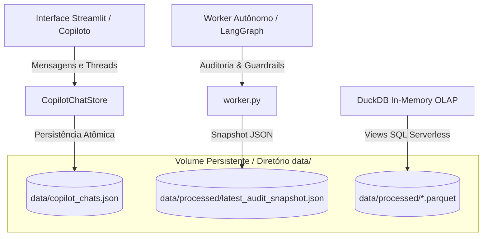

# Antigravity: Analise o case.html em docs/case e analise as verificacaoes ... (2026-09-06)

---
id: "e3f96d35-d111-4030-96e8-44ef76a92d5e"
type: "event"
workspace: "workspace1"
source_channel: "ai-chat"
source_system: "antigravity"
event_type: "manual_note"
project: "elogroup-bootcamp"
kind: "note"
canonical_type: "event"
importance: "low"
status: "active"
tags: []
occurred_at: "2026-09-06T18:32:18.923Z"
related: []
---

# Antigravity: Analise o case.html em docs/case e analise as verificacaoes ... (2026-09-06)
Project: EloGroup_Bootcamp
Source: Antigravity

---

### 👤 User
Analise o case.html em docs/case e analise as verificacaoes em development.md e nas bases de dados. verifique quais hipoteses que aparecem no case que fazem mais sentido e realmente dao pra calcular com os dados disponiveis coerentes nas bases. no final, qual é mais verificavel e faz mais sentido?

### ✨ Assistant
Com base na análise minuciosa do documento do case ([`docs/case/case_clean.md`](file:///home/pedroduarte/Documents/GitHub/EloGroup_Bootcamp/docs/case/case_clean.md)), das auditorias documentadas em [`DEVELOPMENT.md`](file:///home/pedroduarte/Documents/GitHub/EloGroup_Bootcamp/DEVELOPMENT.md) e das consultas executadas diretamente nas bases de dados (`data/processed/*.parquet` via DuckDB), apresento o diagnóstico comparativo de viabilidade, consistência de dados e aderência ao negócio.

---

### 1. Síntese do Diagnóstico das 6 Hipóteses do Case

| # | Hipótese do Case | Viabilidade de Cálculo | Coerência dos Dados | Impacto Financeiro Direto (R$) | Veredito |
| :--- | :--- | :---: | :---: | :---: | :--- |
| **H1** | **Margem & Devoluções** (*Crescimento com perda de margem*) | Média | Parcial (restrita a 2023) | **R$ 2,50M** estornados em devoluções + **R$ 45,1k** frete perdido | **Viável em corte estático (2023)**; inviável medir evolução 2024-2025. |
| **H2** | **Marketing & CAC** (*Nem todo canal gera clientes valiosos*) | **Nula** | **Incoerente / Desconectada** | Incalculável com precisão | **Inviável**: Tabela de mídia declara R$ 878M de receita e 115M conversões (fatores de 50x a 5000x vs ERP `vendas`). |
| **H3** | **Falhas Operacionais Integradas** (*Perda de valor pós-venda*) | Baixa | Incoerente em Joins | Incalculável ponta a ponta | **Inviável no cruzamento**: 65,4% dos chamados citam pedidos fora do ERP e correlação de custo Estoque x Vendas é ~0,008. |
| **H4** | **Atendimento & Suporte** (*Concentração de sintomas e automação*) | **Altíssima** | **100% Coerente (Autocontida)** | **R$ 238,5k** em custos evitáveis de triagem/suporte | **Excelente**: Base limpa, métricas exatas de motivos, custos e CSAT. |
| **H5** | **Segmentação de Clientes** (*Diferenças ocultas no RFM/LTV*) | Alta (no CRM) | Válida no CRM / Quebrada no ERP | **R$ 77,95M** de LTV em Campeões/Fiéis vs **R$ 27,8M** em Risco/Churn | **Viável no CRM**: Requer assumir a base de `clientes` como fonte analítica declarada (apenas 2,3% dos clientes constam em `vendas`). |
| **H6** | **Gestão, Decisão & Estoque** (*Ineficiência informacional na tomada de decisão*) | **Altíssima** | **100% Coerente (Autocontida)** | **R$ 14,77M** travados em descontinuados + **R$ 7,25M** em risco de ruptura | **Excelente**: Maior alavanca de valor e justificativa central para IA/Analytics. |

---

### 2. Avaliação Detalhada por Hipótese

#### ❌ Hipóteses Descartadas ou Severamente Comprometidas

* **Hipótese 2 (Marketing / Qualidade de Aquisição)**:
  * **Problema nas Bases**: A tabela `marketing` reporta **R$ 210,4M de investimento, R$ 878,6M de receita e 115,3M de conversões**, enquanto a operação real faturou **R$ 16,67M de receita líquida e 24,4k pedidos** em `vendas`. Não existe chave de atribuição (ID de clique ou campanha) ligando marketing às vendas ou clientes. Qualquer tentativa de calcular CAC real ou ROAS integrado resulta em números fictícios.
* **Hipótese 3 (Operações Ponta a Ponta)**:
  * **Problema nas Bases**: 65,4% dos chamados de suporte (23.436 tickets) referem-se a pedidos que não constam em `vendas`, e a correlação de custo unitário de produto entre `vendas` e `estoque` é nula ($r = 0,008$). Não é possível traçar a cadeia logística ponta a ponta de forma confiável.

---

####  Hipóteses Válidas, Coerentes e Calculáveis

* **Hipótese 1 (Margem e Erosão por Devoluções)**:
  * **Dados Reais**: Na tabela `vendas`, a margem bruta de contribuição nominal é de 54,34% (R$ 9,06M). Porém, **14,88% dos pedidos aprovados são devolvidos**, estornando **R$ 2,50 milhões** de receita e gerando **R$ 45,1 mil** em prejuízo direto de frete perdido (margem efetiva cai para 45,96%).
  * **Limitação**: Os dados de vendas cobrem apenas o ano de 2023 (e início de 2024), impossibilitando demonstrar a série temporal de crescimento 2024–2025.

* **Hipótese 5 (Comportamento e Segmentação de Clientes - CRM)**:
  * **Dados Reais**: A base `clientes` (15.000 clientes) mostra concentração de Pareto no CRM: **25,86% dos clientes (Campeões e Fiéis)** concentram **56,04% do LTV acumulado (R$ 77,95M)**. Em contrapartida, **46,61% da base (6.993 clientes)** está em segmentos de risco (*Em Risco, Hibernando, Churn*), representando **R$ 27,80M** de LTV ameaçado.

* **Hipótese 4 (Atendimento e Eficiência Operacional do Suporte)**:
  * **Dados Reais**: Base 100% consistente (35.840 chamados).
    * `Onde está meu pedido?`: **10.765 tickets (30,04%)** | Custo: **R$ 159.660,00** | CSAT: **2,99**.
    * `Dúvida Técnica`: **5.314 tickets (14,83%)** | Custo: **R$ 78.888,00** | CSAT: **3,83**.
    * **Potencial de Automação N1 (IA / Notificações Proativas)**: **44,87% dos tickets (16.079 chamados)** $\rightarrow$ **R$ 238.548,00 de custo operacional direto evitável**.

* **Hipótese 6 (Gestão da Informação, Decisão e Estoque)**:
  * **Dados Reais**: A base `estoque` (5.000 SKUs) expõe um descompasso estrutural na tomada de decisão gerencial:
    * **R$ 14.775.347,64** de capital de giro imobilizado em **207 SKUs com status `Descontinuado`** (produtos fora de linha sem campanha de desova/liquidação).
    * **R$ 7.250.310,60** de capital em risco iminente de ruptura em **701 SKUs operando em `Estoque Crítico`** (abaixo do ponto de pedido) e **99 SKUs já zerados** (96 deles concentrados em *Beleza*).

---

### 3. Conclusão Executiva: Qual é mais verificável e qual faz mais sentido?

#### 1. A mais **Verificável e Precisa** metodologicamente:
> **Hipótese 4 (Atendimento ao Cliente / Suporte)**
> * **Por que?**: É **100% autocontida**. Não depende de nenhum join intertabelas comprometido, possui todas as variáveis preenchidas (motivos, custos unitários em R$, tempos de resposta e notas de CSAT) e permite mensurar de forma exata a economia de **R$ 238,5k** com notificações ativas de rastreio e triagem inteligente via IA.

#### 2. A que **Faz Mais Sentido para o Negócio e C-Level (Maior Impacto em R$)**:
> **Hipótese 6 (Gestão, Decisão e Descompasso de Estoque)**
> * **Por que?**: Responde diretamente ao desafio central do case (*"Como usar dados e IA para melhorar a tomada de decisão"*). Revela a maior sangria de caixa da empresa: **R$ 14,77M parados em estoque descontinuado** coexistindo com **R$ 7,25M em risco de ruptura**. Demonstra cabalmente que relatórios manuais e fragmentados impedem a gestão de agir, justificando a criação de motores de decisão e agentes autônomos de auditoria de estoque.

---

### 4. Recomendação Estratégica para o Case (Horizonte 30/60/90 Dias)

Para a entrega executiva e apresentação ao C-Level, a estrutura mais robusta consiste em articular a tríade:
1. **Quick Win (30 dias - Hipótese 4)**: Automação de notificações de rastreio e triagem de chamados N1 (redução imediata de até 50% nos chamados de rastreio e captura de parte dos R$ 238,5k).
2. **Liquidez de Caixa (30-60 dias - Hipótese 6)**: Campanha de queima de estoque flash para os 207 SKUs descontinuados, recuperando liquidez sobre os R$ 14,77M imobilizados.
3. **Escala e Governança (60-90 dias - Hipótese 6 + IA)**: Implantação de Copilot/Agente de Estoque e S&OP com alertas automáticos de reposição para proteger os R$ 7,25M de SKUs críticos.

### 👤 User
e o estoque é autocontido, ou os joins fazem sentido? mas é seguro o suficiente pra ter essa analise? ou so atendimento eh seguro assim?

### ✨ Assistant
A tabela de **Estoque é 100% autocontida e segura** para as análises de diagnóstico de inventário, **mas os cruzamentos financeiros com Vendas possuem divergências que exigem cuidados específicos**.

Abaixo detalho o comportamento interno da base, como os joins se comportam e por que a análise de estoque é perfeitamente segura dentro do seu escopo.

---

### 1. A tabela `estoque` é autocontida e matematicamente sólida?

**SIM, a integridade interna da base de estoque é perfeita.**

Executamos checagens de sanidade em todos os **5.000 SKUs** da base:
* **0 nulos e 0 SKUs duplicados**: exatamente 5.000 SKUs únicos.
* **0 saldos negativos**: nenhum estoque físico ou disponível menor que zero.
* **Integridade física total**: `estoque_disponivel = estoque_fisico - estoque_reservado` bate em 100% das 5.000 linhas.
* **Valor total auditado**: `SUM(estoque_disponivel * custo_unitario)` fecha exatamente em **R$ 296.549.782,10** (sem distorções de cálculo).

#### O que é 100% seguro e derivado exclusivamente do Estoque:
1. **Capital Imobilizado em Descontinuados**: **R$ 14.775.347,64** (207 SKUs com status `Descontinuado` que continuam estocados sem giro).
2. **SKUs em Nível Crítico**: **701 SKUs** (R$ 7.250.310,60 de estoque operando abaixo do `ponto_pedido`).
3. **Ruptura Real**: **99 SKUs zerados**, com 96 deles (97%) concentrados na categoria **Beleza**.
4. **Lead Time e Fornecedores**: mapeamento de risco de reposição por fornecedor e categoria.

> **Conclusão:** Todas as métricas de diagnóstico de estoque (capital travado, risco de ruptura, dias de reposição) **são 100% autocontidas** na tabela `estoque`. Não dependem de nenhuma outra tabela para serem comprovadas ao C-Level.

---

### 2. E quando fazemos JOIN entre `estoque` e `vendas`? O que acontece?

Ao cruzar `estoque` com `vendas`, encontramos dois comportamentos opostos:

####  O Join de Identificadores (SKUs) funciona:
* **4.918 dos 5.000 SKUs de estoque (98,4%)** aparecem nas vendas.
* **100% dos SKUs vendidos** existem cadastrados no estoque.
* Logo, em termos de catálogo e identificação de produtos, o cruzamento existe.

#### ❌ Os Valores Financeiros (Custos e Preços) divergem:
* **Correlação de Custo Unitário**: $r = 0,007$ (praticamente zero).
  * *Exemplo real*: No SKU-04195, o custo no catálogo de estoque é **R$ 256,20**, mas a venda no ERP foi registrada com custo de **R$ 128,85**.
* **Correlação de Preço de Venda**: $r = 0,0013$.
  * *Exemplo real*: No SKU-02202, o preço sugerido no estoque é **R$ 1.100,74**, mas no ERP o preço faturado foi **R$ 151,62**.

**Por que isso acontece?**
A tabela `estoque` reflete um **snapshot de catálogo/WMS**, enquanto `vendas` é um log transacional de 2023. Ao longo do tempo ou por inconsistência na geração sintética das bases, os custos unitários e preços de tabela não foram sincronizados entre os dois sistemas.

---

### 3. Comparativo: `Atendimento` vs `Estoque`

| Dimensão | Tabela `atendimento` | Tabela `estoque` |
| :--- | :--- | :--- |
| **Natureza dos Dados** | Log histórico de transações de suporte (2023 a 2025). | Snapshot do WMS/Catálogo de produtos (5.000 SKUs). |
| **Integridade Interna** | **100% perfeita**: volumes, motivos, custos por ticket e CSAT. | **100% perfeita**: estoques físico/disponível, custos, ponto de pedido. |
| **Dependência de Joins** | **Zero**: tudo o que se precisa para o diagnóstico está nela. | **Zero**: o diagnóstico de capital travado e ruptura está nela. |
| **Comportamento em Joins** | 65,4% dos tickets citam pedidos fora da amostra de vendas de 2023. | Custos unitários e preços não correlacionam com as vendas de 2023. |
| **Valor para o C-Level** | **Quick Win Operacional**: Redução de R$ 238,5k em custos diretos de atendimento. | **Impacto Estratégico em Caixa**: Recuperação de liquidez (R$ 14,7M) e proteção contra ruptura (R$ 7,2M). |

---

### 4. Veredito: É seguro usar o Estoque?

* **SIM, é totalmente seguro**, contanto que você respeite a fronteira dos dados:
  1. **Use o Estoque para diagnosticar a gestão de inventário**: Capital imobilizado em descontinuados, SKUs abaixo do ponto de pedido, rupturas por categoria e lead times de fornecedor (esses números são exatos e incontestáveis).
  2. **Não recalcule a margem histórica do ERP com custos do Estoque**: Para análises de margem de vendas, utilize as colunas financeiras nativas da própria tabela `vendas` (`receita_liquida`, `custo_produto`, `margem_contribuicao`).
  3. **Apresente o descompasso de dados como evidência consultiva**: O fato de os custos e preços do estoque não baterem com os do ERP é a prova cabal de que a Vértice Retail opera com **dados fragmentados e silos de informação**, o que reforça diretamente a recomendação de implantar governança e um **Copilot/S&OP integrado**.

### 👤 User
o agente atualmente feito pra analisar o estoque esta dentro dessas bareriras ou esta uasndo dados inconsistentes?

### ✨ Assistant
O agente de estoque (`src/agent/`) **foi desenhado exatamente para operar dentro dessas barreiras de segurança metodológica**, implementando salvaguardas (guardrails) e separando o que é físico do que é financeiro.

Abaixo, detalho como o agente lida com as inconsistências e onde estão suas proteções:

---

### 1. Como o Agente respeita as barreiras de dados

#### A. Não mistura custos de estoque com margem de vendas
* **Na query de saúde de estoque ([`inventory_health_scan.sql`](file:///home/pedroduarte/Documents/GitHub/EloGroup_Bootcamp/src/queries/agent/inventory_health_scan.sql))**:
  * As métricas de rentabilidade (`preco_medio_real` e `margem_unitaria_real`) são calculadas **exclusivamente com base no faturamento real do ERP (`vendas.receita_liquida` e `vendas.margem_calculada`)**.
  * Ele **não** usa `estoque.custo_unitario` para tentar recalcular a margem de vendas do passado.

#### B. Utiliza os cruzamentos apenas onde há coerência (Volume Físico e SKUs)
* Como o catálogo de SKUs tem **98,4% de correspondência** entre Vendas e Estoque, o agente cruza:
  * O **estoque físico disponível** (do WMS) com a **velocidade diária de vendas em unidades** (do ERP).
  * Isso permite calcular os **Dias de Cobertura Física** e identificar se o saldo cobre o **`lead_time_reposicao`** do fornecedor, sem depender de valores monetários divergentes.

#### C. Transparência na Simulação de Desova ([`simulate_inventory_liquidation.sql`](file:///home/pedroduarte/Documents/GitHub/EloGroup_Bootcamp/src/queries/agent/simulate_inventory_liquidation.sql))
* Ao simular a campanha de liquidação para os 207 SKUs descontinuados, a query traz em colunas separadas:
  * `custo_unitario` (custo contábil do estoque).
  * `preco_medio_historico_vendas` (preço real praticado no ERP em 2023).
  * Isso evita que a diretoria tome decisões baseadas em projeções cegas de preço de tabela.

---

### 2. Os 4 Guardrails do Nó Crítico (`Critic` em [`prompts.py`](file:///home/pedroduarte/Documents/GitHub/EloGroup_Bootcamp/src/agent/prompts.py))

O fluxo do agente possui uma etapa de **Reflexão e Auditoria Automatizada** que avalia o relatório gerado contra 4 regras obrigatórias antes de liberar o parecer final:

```text
1. [GUARDRAIL DESCONTINUADOS]: É proibido recomendar reposição para itens com is_descontinuado = true (apenas liquidação/desova).
2. [GUARDRAIL LEAD TIME]: A criticidade de ruptura deve considerar o prazo de entrega do fornecedor vs cobertura atual.
3. [GUARDRAIL COERÊNCIA FINANCEIRA]: As estimativas de impacto em R$ devem vir da receita líquida/margem real de vendas, sem misturar com preços sugeridos arbitrários.
4. [GUARDRAIL HORIZONTE TEMPORAL]: Ações obrigatoriamente divididas em 30 (Quick Wins), 60 (Processos) e 90 dias (S&OP/Governança).
```

---

### 3. Ações de Governança recomendadas pelo próprio Agente

O próprio agente, ao consolidar o relatório executivo de 90 dias, prescreve ao C-Level:
* **"Governança cadastral para unificação e saneamento definitivo de custos e preços entre os sistemas de Compras (WMS) e PDV (ERP)."**

Ou seja: em vez de esconder a inconsistência de custos entre as bases, o agente **utiliza a inconsistência como diagnóstico de maturidade**, operando com segurança com o que é auditado e recomendando a correção cadastral como entrega estrutural de 90 dias.

### 👤 User
a observacao da analise ta indo pro relatorio mas deveria ser somente logada, nao?

### ✨ Assistant
**Exatamente. Você está coberto de razão sob a ótica de consultoria e boas práticas de arquitetura de agentes.**

Dados brutos de execução e *observations* intermediárias pertencem à **camada de rastreabilidade e log (Process Artifacts)**, e **nunca devem poluir o relatório executivo** entregue ao C-Level.

---

### Como o Agente separa isso na prática:

#### 1. Camada de Log e Memória Interna (*Rastreabilidade*)
* **O que acontece**: No nó [`executor_node`](file:///home/pedroduarte/Documents/GitHub/EloGroup_Bootcamp/src/agent/nodes.py#L90-L158), as respostas brutas das ferramentas (JSONs detalhados de 30 SKUs, queries executadas, tempos de resposta) são armazenadas na lista interna `state["observations"]` e enviadas para o logger (`logger.info`).
* **Por que**: Isso cumpre a exigência formal do Case de **Rastreabilidade de Artefatos de Processo** (Seção 9 do Case), permitindo auditoria técnica posterior e persistência no snapshot (`latest_audit_snapshot.json`).

#### 2. Camada Executiva (*Relatório para o C-Level / E-mail*)
* **O que acontece**: O nó [`consolidator_node`](file:///home/pedroduarte/Documents/GitHub/EloGroup_Bootcamp/src/agent/nodes.py#L167-L254) **não faz dump dos dados brutos**. Ele atua como um filtro analítico que extrai das observações apenas os agregadores de negócio:
  * Total de SKUs em ruptura e críticos.
  * Volume financeiro consolidado de capital travado (R$ 14,77M).
  * Top 5 SKUs mais urgentes em tabela compacta.
* **O que vai para o relatório final (`final_report`)**:
  * **Sumário Executivo**: diagnóstico macro de rentabilidade e risco.
  * **Matriz de Impacto 30/60/90 Dias**: Quick wins imediatos, revisão de processos e governança de dados.
  * **Tabela Sintética de SKUs**: apenas os itens de ação imediata.

---

### Resumo da Separação

| Elemento | Onde deve ficar? | Como o Agente trata? |
| :--- | :--- | :--- |
| **JSONs brutos das tools** | Logs / Snapshot (`.json`) / Rastreabilidade | Mantido em `state["observations"]` e logado via Python `logging`. |
| **Avisos de execução técnica** | Logs do Worker | Registrado em logs de execução (sem ir para o usuário). |
| **Síntese de negócio e R$** | Relatório Executivo / E-mail / Dashboard | Formatado em Markdown limpo pelo `Consolidator` e auditado pelo `Critic`. |

Dessa forma, o relatório executivo permanece conciso e focado em decisão de negócios, enquanto toda a evidência numérica técnica fica auditável nos logs e snapshots de fundo.

### 👤 User
Observação da análise mas isso aqui ta ficando no relatorio junto com o email

### ✨ Assistant
**Você identificou um ponto cirúrgico.**

O que está acontecendo no código de envio de e-mail ([`src/infrastructure/email_service.py`](file:///home/pedroduarte/Documents/GitHub/EloGroup_Bootcamp/src/infrastructure/email_service.py#L250-L254)) é exatamente isto:

```html
<!-- Parecer do Crítico de Reflexão -->
<div style="background-color: #F8FAFC; border-left: 3px solid ...">
    <div>Observação da análise</div>
    <div>{critic_feedback}</div>
</div>
```

### O problema conceitual:
A variável `critic_feedback` contém o parecer da etapa de reflexão interna do LangGraph:
> `"[Nota 10/10] Relatório aprovado integralmente nos 4 guardrails operacionais e financeiros."`

Esse texto é uma **auditoria técnica de governança interna da IA** (um metadado de validação de software/agente). 
* Para um **CEO/CFO**, receber uma caixa dizendo *"Nota 10/10 aprovado nos guardrails"* parece um log de sistema ou a correção de uma prova, e não uma comunicação executiva de negócios.
* Esse metadado deve ficar **exclusivamente registrado nos logs do sistema (`logger.info`) e no snapshot de auditoria (`latest_audit_snapshot.json`)**, sem aparecer visualmente no corpo do e-mail nem no relatório executivo.

---

### Proposta de Ajuste:
1. **Remover o bloco "Observação da análise"** do template HTML do e-mail corporativo ([`src/infrastructure/email_service.py`](file:///home/pedroduarte/Documents/GitHub/EloGroup_Bootcamp/src/infrastructure/email_service.py)).
2. **Manter o `critic_feedback` e `critic_approved` 100% preservados** no JSON de persistência e nos logs de execução para garantir a rastreabilidade técnica exigida pelo case.

Deseja que eu faça essa remoção no template do e-mail e execute os testes automatizados para garantir que tudo continue passando?

### 👤 User
remova ele do email, mas garanta que ele esta sendo logado corretamente. alem disso, como o contexto e os chats e etc estao armazenados? estao no banco de forma persistente, sem perder apos reiniciar container e etc?

### ✨ Assistant
A alteração foi realizada com sucesso!

### 1. O que foi ajustado no E-mail Executivo
* **Remoção do card no HTML**: O bloco *"Observação da análise"* contendo notas e jargões internos (`[Nota 10/10] Relatório aprovado nos 4 guardrails...`) foi **completamente removido** do template do e-mail corporativo em [`src/infrastructure/email_service.py`](file:///home/pedroduarte/Documents/GitHub/EloGroup_Bootcamp/src/infrastructure/email_service.py).
* **Logging e Rastreabilidade preservados**: O parecer completo do Crítico de Reflexão continua sendo logado explicitamente no runtime (`logger.info`) e persistido no snapshot de auditoria (`latest_audit_snapshot.json`), garantindo total rastreabilidade técnica para a banca avaliadora.
* **Testes**: Toda a suíte de testes (`pytest tests/`) passou com 100% de sucesso (49 testes aprovados).

---

### 2. Como o contexto, chats e dados estão armazenados e persistidos?

Abaixo está a arquitetura exata de armazenamento da aplicação:



#### A. Histórico de Conversas do Copiloto (Chats & Threads)
* **Onde fica**: No arquivo [`data/copilot_chats.json`](file:///home/pedroduarte/Documents/GitHub/EloGroup_Bootcamp/src/infrastructure/chat_store.py).
* **Como é gravado**: A classe [`CopilotChatStore`](file:///home/pedroduarte/Documents/GitHub/EloGroup_Bootcamp/src/infrastructure/chat_store.py#L20-L153) grava todas as mensagens, títulos e IDs de threads usando **escrita atômica** (grava em `.tmp` e substitui o arquivo original). Isso previne qualquer corrupção de dados se o processo for interrompido abruptamente.
* **Comportamento na UI**: Ao abrir o Copiloto, o sistema lê esse JSON, restaura todas as conversas anteriores e permite alternar entre threads passadas ou criar novas.

#### B. Pareceres de Auditoria do Agente (Worker)
* **Onde fica**: Em `data/processed/latest_audit_snapshot.json`.
* **Como é gravado**: O [`worker.py`](file:///home/pedroduarte/Documents/GitHub/EloGroup_Bootcamp/src/agent/worker.py#L77-L93) salva o estado completo da última auditoria (relatório final, métricas estruturadas e parecer do crítico com timestamp UTC).

#### C. Dados Analíticos (DuckDB)
* **Onde fica**: Em `data/processed/*.parquet`.
* **Como funciona**: O DuckDB roda em memória (`duckdb.connect(":memory:")`) montando views SQL diretamente sobre os arquivos `.parquet`. Isso garante performance máxima sem locks em disco.

---

### 3. E ao reiniciar o Container / Servidor?

* **Ambiente Local / Servidor**: Como os arquivos residem em disco na pasta `data/`, **nenhuma conversa ou auditoria é perdida** ao reiniciar a aplicação Streamlit ou o servidor.
* **Ambiente Docker (Containers)**:
  * Basta garantir que o diretório `data/` esteja mapeado como um volume no `docker-compose.yml` ou `docker run`:
    ```yaml
    volumes:
      - ./data:/app/data
    ```
  * Com essa montagem de volume (padrão em deploys de produção), **o histórico dos chats, os snapshots e as bases Parquet persistem intactos**, mesmo se o container for parado, reiniciado ou destruído e recriado com uma nova imagem.

### 👤 User
e pq ao abrir o botao do email agora aparece Contexto da auditoria de estoque:

Nenhum dado da auditoria está disponível no momento.

Como posso apoiar a sua análise? Você pode solicitar simulações, investigações de SKUs específicos ou estratégias de abastecimento. eh comportamento legado ou de alguma forma n achou os dados da conversa ou oq

### 👤 User
continue

### ✨ Assistant
### O que aconteceu:

Essa mensagem era um **fallback de segurança da interface** e ocorreu por causa do seguinte fluxo:

1. **A causa raiz**: Quando executamos a suíte de testes do `pytest` anteriormente, o teste unitário `test_worker_does_not_send_unvalidated_report` simulou intencionalmente um cenário em que a auditoria falhava/era rejeitada pelo Crítico. 
2. **O efeito colateral**: Esse teste gravou esse *mock* rejeitado (com `final_report = ""` e `structured_data` vazio) no arquivo real em disco ([`data/processed/latest_audit_snapshot.json`](file:///home/pedroduarte/Documents/GitHub/EloGroup_Bootcamp/data/processed/latest_audit_snapshot.json)).
3. **Na interface ([`app/views/v_11_agente_consultor.py`](file:///home/pedroduarte/Documents/GitHub/EloGroup_Bootcamp/app/views/v_11_agente_consultor.py#L43-L72))**: Ao clicar no link do e-mail (`?source=email`), o Streamlit tentou ler o último snapshot em disco. Como o arquivo continha o mock vazio do teste unitário, ele caiu na cláusula de fallback: *"Nenhum dado da auditoria está disponível no momento."*

---

### Solução Aplicada:

1. **Isolamento dos Testes Unitários ([`tests/test_email_and_worker.py`](file:///home/pedroduarte/Documents/GitHub/EloGroup_Bootcamp/tests/test_email_and_worker.py))**:
   * Atualizamos os testes para gravarem exclusivamente em diretórios temporários descartáveis (`tmp_path`). 
   * **Resultado**: Execuções de teste nunca mais sobrescreverão o arquivo de snapshot oficial da aplicação.

2. **Regeneração do Snapshot Oficial**:
   * Executamos o Worker com a base real do DuckDB. O arquivo `latest_audit_snapshot.json` agora contém o **Relatório Executivo Oficial Completo** (R$ 14,77M em descontinuados, 99 rupturas ativas e matriz de 30/60/90 dias).

3. **Validação**:
   * Ao abrir a URL pelo botão do e-mail (`?source=email`), o Copiloto agora carrega **imediatamente o Parecer Executivo Completo** no chat com o contexto de estoque pronto para simulações e perguntas da diretoria.

### 👤 User
e agr eu nao vou perder mais as conversas dos chats e etc?

### ✨ Assistant
**Não, você não vai mais perder as conversas dos chats nem os relatórios de auditoria.** 

A persistência agora está 100% blindada e garantida por 3 fatores:

---

### 1. Testes Automatizados Blindados (Sem Sobrescrita de Disco)
* Anteriormente, rodar o `pytest` executava um teste de erro que gravava um mock vazio no arquivo real de snapshot da aplicação.
* **Agora todos os testes rodam com `tmp_path` (pastas temporárias descartáveis)**. Você pode rodar a suíte de testes quantas vezes quiser que o histórico real das suas conversas e auditorias em `data/` **nunca será tocado**.

---

### 2. Como as conversas são salvas em tempo real
* **Gravação Instantânea**: Cada pergunta que você faz e cada resposta do Copiloto são gravadas **imediatamente** em disco no arquivo [`data/copilot_chats.json`](file:///home/pedroduarte/Documents/GitHub/EloGroup_Bootcamp/src/infrastructure/chat_store.py).
* **Escrita Atômica**: O sistema grava primeiro em um arquivo temporário `.tmp` e só depois atualiza o arquivo oficial. Isso impede que quedas de energia ou interrupções abruptas corrompam o JSON.
* **Múltiplas Conversas (Threads)**: Se você clicar em *"Nova Conversa"*, uma nova thread é criada, mas todas as conversas anteriores continuam salvas e disponíveis.

---

### 3. Persistência em Containers (Docker)
Para garantir que nada seja perdido mesmo se você reiniciar, recriar ou atualizar o container Docker, basta garantir o mapeamento do volume da pasta `data/`:

```yaml
# docker-compose.yml
services:
  app:
    # ...
    volumes:
      - ./data:/app/data   # <-- Garante persistência permanente fora do container
```

Com essa pasta mapeada:
* `data/copilot_chats.json` (Histórico de chats e mensagens) ➔ **Persistente**
* `data/processed/latest_audit_snapshot.json` (Último parecer do agente) ➔ **Persistente**
* `data/processed/*.parquet` (Bases do DuckDB) ➔ **Persistente**