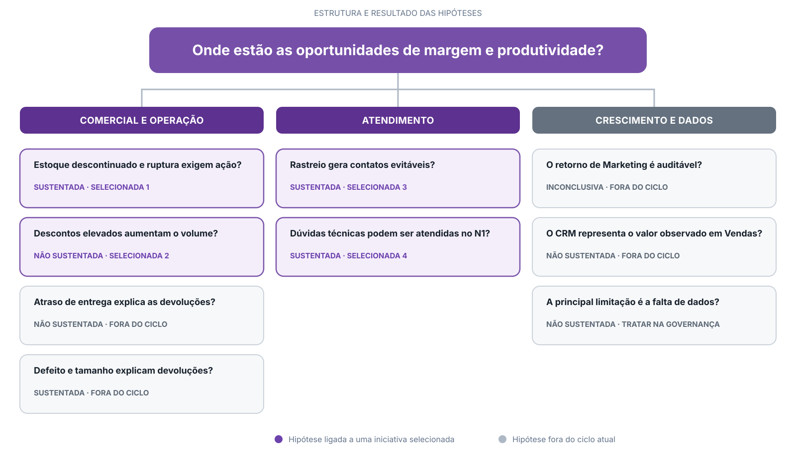

# Diagnóstico Executivo e Plano de Ação
**Bootcamp EloGroup 2026 · Grupo 14**  
**Autores:** Pedro Augusto & Pedro Lobo

---

## Sumário executivo

A Vértice Retail faturou **R$ 16,67 milhões líquidos** no período analisado e manteve margem de contribuição entre **54,2% e 54,9%**. As oportunidades priorizadas são estoque, descontos, rastreio e atendimento N1.

## Árvore de hipóteses

## Diagnóstico das hipóteses

| Hipótese | Conclusão | Evidência | Decisão |
| --- | --- | --- | --- |
| Estoque descontinuado e risco de ruptura exigem ação. | Sustentada | 207 SKUs descontinuados com saldo; 99 SKUs sem estoque disponível e 701 abaixo do ponto de pedido. | **Selecionada — prioridade 1** |
| Descontos elevados aumentam o volume. | Não sustentada | Acima de 20%, a margem cai de 58% para 39%; o teste within-SKU indica variação de −0,02 unidade. | **Selecionada — prioridade 2** |
| Atraso de entrega explica as devoluções. | Não sustentada | A taxa de devolução permanece próxima entre entregas de 0–3 dias e 16–20 dias. | Fora do ciclo |
| Defeito e tamanho inadequado explicam parte das devoluções. | Sustentada | Os motivos se concentram em qualidade do produto e adequação de tamanho. | Fora do ciclo |
| Consultas de rastreio geram demanda evitável. | Sustentada | 30,0% dos tickets consultam a localização do pedido. | **Selecionada — prioridade 3** |
| Dúvidas técnicas podem ser atendidas no N1. | Sustentada | 14,8% dos tickets são dúvidas técnicas. | **Selecionada — prioridade 4** |
| O retorno de Marketing pode ser comparado entre canais. | Inconclusiva | As campanhas não possuem atribuição confiável aos pedidos do ERP. | Fora do ciclo |
| A segmentação do CRM representa o valor observado em Vendas. | Não sustentada | O LTV cadastral diverge do histórico transacional e a correlação observada é −0,003. | Fora do ciclo |
| A principal limitação é a falta de dados. | Não sustentada | As bases existem, mas apresentam períodos, chaves e custos divergentes. | Tratar na governança |

## Oportunidades selecionadas

1. **Predictive Stock Advisor:** prioriza ações para descontinuados, bloqueia recompras e alerta reposição de itens ativos.
2. **Margin Recovery Advisor:** recomenda o teto de desconto por SKU para proteger a margem.
3. **Rastreio proativo:** envia atualizações de status e link de acompanhamento do pedido.
4. **Atendimento N1:** responde dúvidas técnicas validadas e transfere exceções para atendimento humano.

## Business case resumido

| Métrica | Cenário-base |
| --- | ---: |
| Receita estimada da liquidação, pós-devoluções | **R$ 4,14M** |
| Margem recuperada por descontos | **R$ 1,80M/ano** |
| Economia operacional em CX | **R$ 55,7 mil/ano** |
| Investimento no primeiro ano | **R$ 350 mil** |
| ROI líquido no primeiro ano | **4,3x** |
| Payback estimado | **2,3 meses** |

## Premissas do cenário

- **Estoque:** 50% de sell-through dos descontinuados em 90 dias, desconto médio de 30% e ajuste de 14,88% para devoluções.
- **Base de cálculo:** saldo disponível de Estoque; preço, custo, frete e devoluções históricos de Vendas.
- **Descontos e CX:** estimativas a validar no ciclo de 90 dias.
- **ROI:** considera margem recuperada em descontos e economia em CX; a receita da liquidação é apresentada separadamente.

## Plano 30-60-90 dias

| Prazo | Entrega | Critério de acompanhamento |
| --- | --- | --- |
| 30 dias | Operação assistida do Predictive Stock Advisor; preparação da integração de descontos e da base de Atendimento N1. | Recomendações válidas, sell-through e receita realizada. |
| 60 dias | Calibração do Predictive Stock Advisor; ativação do Margin Recovery Advisor e das notificações de rastreio. | Margem cedida, volume diário e tickets de rastreio. |
| 90 dias | Manutenção do Margin Recovery Advisor; ativação do Atendimento N1 e calibração do rastreio. | Resolução sem recontato em 7 dias e CSAT. |

## Riscos, mitigantes e gatilhos

| Frente | KPI e gatilho | Ação em caso de desvio |
| --- | --- | --- |
| Estoque | Pelo menos 90% de recomendações válidas e zero recompra de descontinuado. | Corrigir regras e dados; bloquear recomendações inválidas. |
| Descontos | Reduzir em 50% a margem cedida acima do teto por SKU, sem queda superior a 5% no volume. | Revisar custo, frete e devoluções; recalibrar os limites. |
| Rastreio | Reduzir em 30% os tickets de rastreio em 30 dias. | Revisar eventos, entrega das mensagens e clareza do status. |
| Atendimento N1 | Pelo menos 60% de resolução sem recontato em 7 dias e CSAT igual ou superior ao baseline. | Revisar respostas, restringir intenções e ampliar o escalonamento humano. |

## Decisão solicitada

Aprovar o ciclo de 90 dias, com revisão dos KPIs nos dias 30, 60 e 90. A ampliação do escopo depende do cumprimento dos gatilhos acima.
