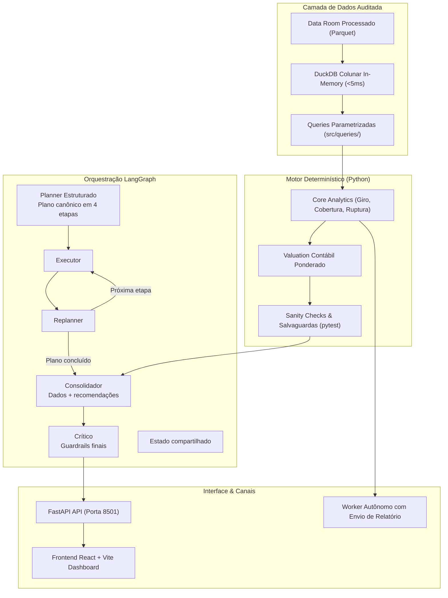

# Arquitetura do Copiloto de IA, Segurança & Governança
**Bootcamp EloGroup 2026 · Grupo 14**  
**Autores:** Pedro Augusto & Pedro Lobo  

---

## 1. Visão Geral da Arquitetura

O Copiloto **Predictive Stock Advisor** foi projetado sob o princípio da **separação estrita entre inteligência determinística e geração de linguagem natural**. 

Modelos de linguagem (LLMs) são probabilísticos e sujeitos a alucinações numéricas. Em consultoria financeira e gestão de estoque, erros de cálculo geram perdas de milhões. Portanto, **o LLM nunca realiza cálculos de margem, giro ou valuation; ele apenas interpreta, contextualiza e formata saídas produzidas por ferramentas determinísticas**.

---

## 2. Componentes Técnicos Implementados

### 2.1 Motor Analítico Determinístico (`src/agent/inventory_analytics/`)
- **Módulo Financeiro (`financial.py`):** Calcula o capital imobilizado e a exposição financeira utilizando o custo médio ponderado realizado em vendas (`vendas`), neutralizando a divergência de custos da base de estoque.
- **Módulo Operacional (`operational.py`):** Avalia os 207 SKUs descontinuados e os 701 SKUs com saldo abaixo do ponto de pedido, segmentando por categoria e lead time do fornecedor.
- **Módulo de Qualidade & Consolidação (`validation.py` e `consolidation.py`):** Executa sanity checks antes de liberar qualquer número para o agente.

### 2.2 Planner e Fluxo de Execução (`src/agent/graph.py` e `nodes.py`)
- **Planner:** carrega um plano canônico de quatro etapas: estoque, demanda e capital, devoluções e recomendações 30-60-90.
- **Executor e Replanner:** percorrem o plano e registram a conclusão de cada etapa.
- **Consolidador:** reúne o pacote factual, executa os checks determinísticos e usa o LLM apenas para organizar o parecer e as recomendações.
- **Crítico:** aplica os guardrails finais antes da publicação.

O Planner é estruturado e determinístico: as etapas vêm de `DEFAULT_PLAN_STEPS`, e não são criadas livremente pelo LLM.

### 2.3 Salvaguardas contra Alucinação (`src/agent/deterministic_checks.py`)
- O sistema submete todas as respostas do agente a uma bateria de testes de consistência:
  - **Bloqueio de Invenção de Valores:** Se o texto gerado citar um valor financeiro que não consta no pacote retornado pelas tools, o parecer é invalidado.
  - **Resiliência a Falha de LLM:** Caso a cota da API do modelo se esgote ou ocorra timeout, o sistema publica automaticamente o **Parecer Factual Base**, garantindo que a diretoria nunca fique sem o relatório técnico.
  - **Auditoria Contínua:** Cobertura de testes unitários garantida em [`tests/test_deterministic_checks.py`](file:///home/pedroduarte/Documents/GitHub/EloGroup_Bootcamp/tests/test_deterministic_checks.py).

### 2.4 Copiloto ReAct & Worker Autônomo (`src/agent/copilot.py` e `worker.py`)
- Equipado com ferramentas especializadas:
  - `tool_inventory_health_scan`: consolida ruptura, cobertura e sobre-estoque.
  - `tool_sales_demand_matrix`: cruza estoque e demanda histórica.
  - `tool_returns_and_quality_risk`: identifica riscos de devolução e qualidade.
  - `tool_discontinued_stranded_capital` e `tool_simulate_inventory_liquidation`: avaliam descontinuados e cenários de liquidação.
  - `tool_sku_deep_dive`: detalha um SKU com evidências auditáveis.
- O worker autônomo executa rotinas programadas sob demanda, compila o parecer e despacha o memo executivo por e-mail via serviço integrado ([`src/infrastructure/email_service.py`](file:///home/pedroduarte/Documents/GitHub/EloGroup_Bootcamp/src/infrastructure/email_service.py)).

---

## 3. Matriz de Governança, Riscos & Mitigantes

| Dimensão de Risco | Descrição da Ameaça | Medida de Mitigação Implementada | Gatilho de Reversão / Controle |
| :--- | :--- | :--- | :--- |
| **1. Alucinação de Dados** | Agente sugerir compra de produto descontinuado ou inventar valores. | Separação estrita de funções; motor determinístico valida 100% das saídas. | Zero compras de descontinuados permitidas em regras de negócio. |
| **2. Privacidade & LGPD** | Exposição indevida de dados pessoais de clientes em logs ou prompts. | O copiloto de estoque e descontos opera exclusivamente em nível de SKU e canal agregado. IDs de clientes não são trafegados no LLM. | Anonimização nativa em `src/infrastructure/preprocessor.py`. |
| **3. Drift de Dados** | Mudança no comportamento de vendas invalidar os cálculos de giro. | Recálculo dinâmico baseado no histórico consolidado com janelas configuráveis (`calendar_2023`, `last_90d`). | Alerta ao operador caso a mediana de vendas por SKU mude > 20%. |
| **4. Adoção & Fator Humano** | Resistência do time de compras ou comercial em seguir as recomendações. | Explicações transparentes em linguagem natural acompanhadas das fórmulas de cálculo. Nenhuma ordem é disparada sem aprovação humana. | Alçada executiva necessária para exceções acima do teto recomendado por SKU. |
