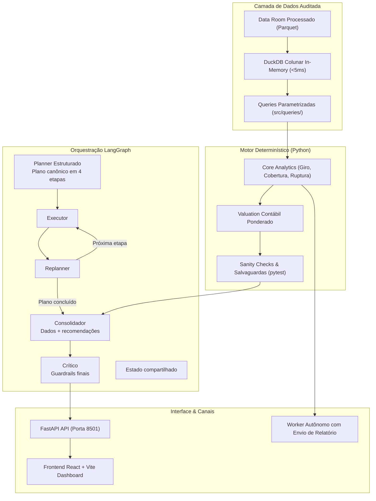

# Arquitetura do copiloto de IA, segurança e governança
**Bootcamp EloGroup 2026 · Grupo 14**  
**Autores:** Pedro Augusto e Pedro Lobo  

---

## 1. Visão geral da arquitetura

O copiloto Predictive Stock Advisor separa a lógica analítica determinística da geração de texto.

Modelos de linguagem são probabilísticos. Em gestão de estoque e finanças, cálculos precisam ser exatos. Por isso, o modelo não calcula margem, giro ou valuation: ele recebe as saídas calculadas pelas consultas e ferramentas analíticas em DuckDB e Python, contextualiza as informações e redige o parecer.

---

## 2. Componentes técnicos implementados

### 2.1 Motor analítico determinístico (`src/agent/inventory_analytics/`)
- Módulo financeiro (`financial.py`): calcula o capital imobilizado e a exposição com base no custo médio ponderado realizado em vendas, contornando a divergência de custos da base de estoque.
- Módulo operacional (`operational.py`): analisa os 207 SKUs descontinuados e os 701 SKUs abaixo do ponto de pedido, segmentados por categoria e prazo de fornecedor.
- Módulo de consolidação e validação (`validation.py` e `consolidation.py`): aplica testes de consistência antes de disponibilizar os dados ao agente.

### 2.2 Planejador e fluxo de execução (`src/agent/graph.py` e `nodes.py`)
- Planner: carrega um plano estruturado em quatro etapas (estoque, demanda e capital, devoluções e recomendações 30-60-90). As etapas são definidas em `DEFAULT_PLAN_STEPS` e não são criadas livremente pelo modelo.
- Executor e Replanner: percorrem o plano e registram a conclusão de cada etapa.
- Consolidador: reúne as métricas apuradas, valida os dados e utiliza o LLM apenas para estruturar a redação do parecer.
- Crítico: aplica salvaguardas antes da resposta final.

### 2.3 Salvaguardas contra inconsistências de dados (`src/agent/deterministic_checks.py`)
As saídas do modelo passam por verificações automáticas de consistência:
- Bloqueio de valores não verificados: se o texto gerado contiver números que não constam nos dados das ferramentas, a resposta é rejeitada.
- Continuidade de serviço: em caso de indisponibilidade ou limite na API do modelo, a aplicação publica o parecer factual gerado deterministicamente.
- Testes automatizados: cobertura garantida em [`tests/test_deterministic_checks.py`](file:///home/pedroduarte/Documents/GitHub/EloGroup_Bootcamp/tests/test_deterministic_checks.py).

### 2.4 Copiloto ReAct e rotina autônoma (`src/agent/copilot.py` e `worker.py`)
Ferramentas analíticas disponíveis:
- `tool_inventory_health_scan`: consolida ruptura, cobertura e sobre-estoque.
- `tool_sales_demand_matrix`: cruza estoque e demanda histórica.
- `tool_returns_and_quality_risk`: identifica riscos de devolução e qualidade.
- `tool_discontinued_stranded_capital` e `tool_simulate_inventory_liquidation`: analisam descontinuados e cenários de liquidação.
- `tool_sku_deep_dive`: detalha SKUs específicos com dados transacionais.

A rotina autônoma executa análises programadas sob demanda, compila o parecer e despacha o resumo executivo por e-mail via [`src/infrastructure/email_service.py`](file:///home/pedroduarte/Documents/GitHub/EloGroup_Bootcamp/src/infrastructure/email_service.py).

---

## 3. Matriz de governança, riscos e mitigantes

| Risco | Descrição | Medida implementada | Gatilho de controle |
| :--- | :--- | :--- | :--- |
| Invenção de dados | Sugestão de recompra de descontinuados ou citação de números incorretos. | Separação de funções; validação determinística de 100% das métricas antes da exibição. | Bloqueio sistêmico de ordens para itens descontinuados. |
| Privacidade e dados pessoais | Exposição de dados de clientes em logs ou prompts. | O copiloto opera apenas em nível de SKU e canal agregado. Identificadores de clientes não entram no prompt. | Anonimização nativa em `src/infrastructure/preprocessor.py`. |
| Mudança de padrão de dados | Alteração brusca no comportamento de vendas afetando o cálculo de giro. | Recálculo dinâmico baseado no histórico com janelas configuráveis. | Alerta quando a mediana de vendas de um SKU variar mais de 20%. |
| Adoção operacional | Dúvidas ou resistência do time comercial em acatar recomendações. | Justificativas com memória de cálculo explícita. Nenhuma ordem de compra é emitida sem validação humana. | Aprovação manual mandatória para exceções ao teto recomendado. |
